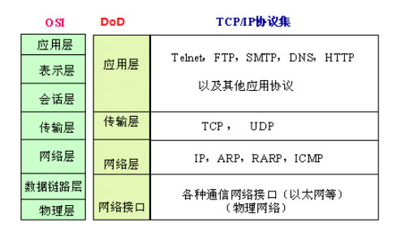
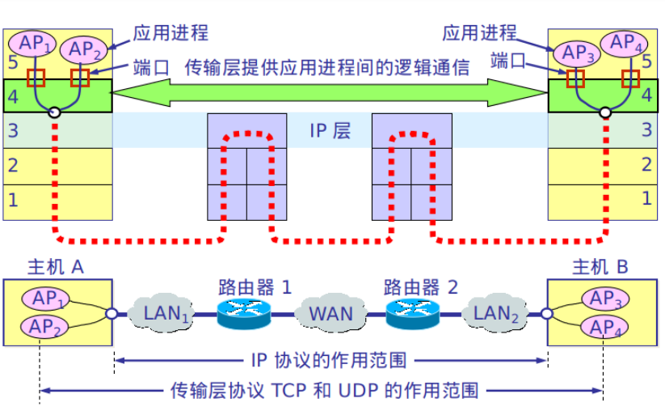
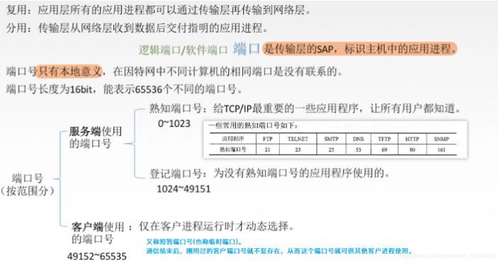
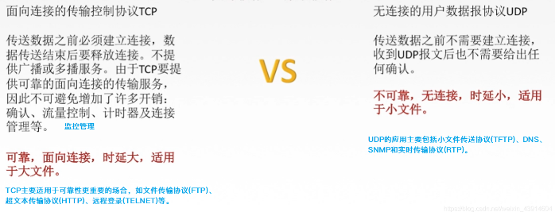
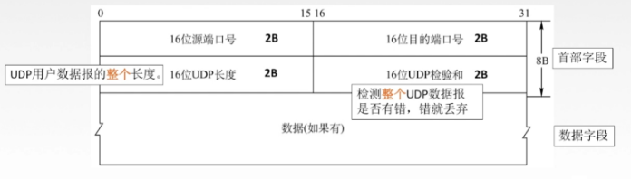
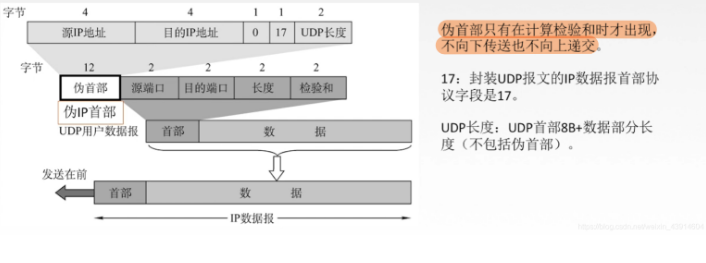
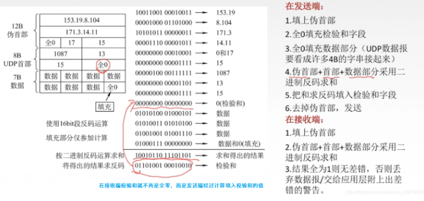
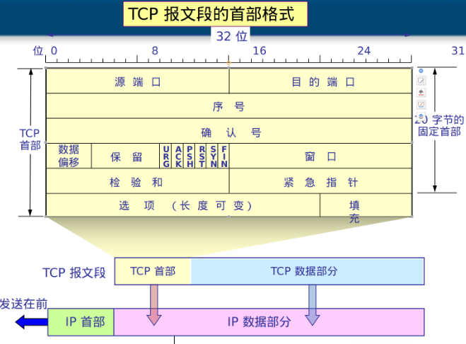
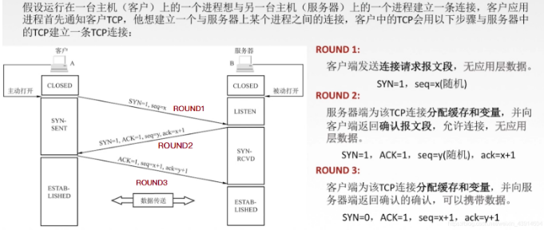
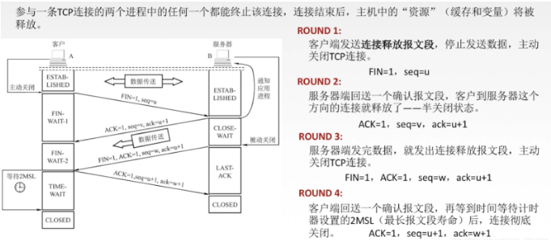

# 1 传输层概述
## 1.1 传输层提供的服务及功能

传输层为应用层提供通信服务，使用网络层的服务
传输层的功能：

+ 传输层提供进程和进程之间的逻辑通信
	+ 网络层提供主机之间的逻辑通信
+ 复用和分用
+ 传输层对收到的报文进行差错检测
+ 传输层的两种协议（UDP/TCP）

1. 传输层提供应用进程之间的逻辑通信（即端到端的通信）
+ 与网络层的区别是，网络层提供的是主机之间的逻辑通信。
+ 从网络层来说，通信的双方是两台主机，IP 数据报的首部给出了这两台主机的IP地址。
+ 但“两台主机之间的通信”实际上是两台主机中的应用进程之间的通信，应用进程之间的通信又称端到端的逻辑通信。
+ 这里“逻辑通信”的意思是:传输层之间的通信好像是沿水平方向传送数据，但事实上这两个传输层之间并没有–条水平方向的物理连接。

2. 复用和分用

- 复用是指发送方不同的应用进程都可使用同一个传输层协议传送数据;
- 分用是指接收方的传输层在剥去报文的首部后能够把这些数据正确交付到目的应用进程。

**注意：**

- 传输层的复用分用功能与网络层的复用分用功能不同。
- 网络层的`复用`是指发送方不同协议的数据都可以封装成IP数据报发送出去,
- 网络层的`分用`是指接收方的网络层在剥去首部后把数据交付给相应的协议。

3. 传输层还要对收到的报文进行差错检测(首部和数据部分)

网络层只检查IP数据报的首部，不检验数据部分是否出错

4. 提供两种不同的传输协议，即面向连接的TCP和无连接的UDP

网络层无法同时实现两种协议(即在网络层要么只提供面向连接的服务，如虚电路;要么只提供无连接服务，如数据报，而不可能在网络层同时存在这两种方式)

## 1.2 传输层的寻址和端口

### 1.2.1 端口作用

- 端口能够让应用层的各种应用进程将其数据通过端口向下交付给传输层，以及让传输层知道应当将其报文段中的数据向上通过端口交付给应用层相应的进程。
- 端口是传输层`服务访问点`(TSAP)，它在传输层的作用类似于IP地址在网络层的作用或MAC地址在数据链路层的作用，只不过`IP地址和MAC地址标识的是主机，而端口标识的是主机中的应用进程`。
- `数据链路层的SAP是MAC地址，网络层的SAP是IP地址，传输层的SAP是端口`。
- 在协议栈层间的抽象的协议端口是软件端口，它与路由器或交换机上的硬件端口是完全不同的概念。
- 硬件端口是不同硬件设备进行交互的接口，而软件端口是应用层的各种协议进程与传输实体进行层间交互的一种地址。
- 传输层使用的是软件端口。

### 1.2.2 端口分类

### 1.2.3 套接字
在网络中通过IP地址来标识和区别不同的主机，通过端口号来标识和区分一台主机中的不同应用进程。在网络中采用发送方和接收方的套接字(Socket)组合来识别端点。
套接字 = （IP，端口号）

## 1.3 无连接UDP和面向连接TCP服务

# 2 UDP
## 2.1 用户数据报协议UDP概述和特点
UDP只是在IP数据服务上面增加了很少的功能，复用分用和差错检测

为什么应用开发人员宁愿在UDP之上构建应用，也不选择TCP?既然TCP提供可靠的服务，而UDP不提供，那么TCP总是首选吗?答案是否定的，因为有很多应用更适合用UDP，主要是因为UDP具有如下优点:

**1) UDP无须建立连接。**

- UDP不会引入建立连接的时延。
- 试想如果DNS运行在TCP而非UDP上，那么DNS的`速度`会慢很多。
- HTTP使用TCP而非UDP，是因为对于基于文本数据的Web网页来说，`可靠性`是至关重要的。

**2) 无连接状态。**

- TCP需要在端系统中维护连接状态。此连接状态包括接收和发送缓存、拥塞控制参数和序号与确认号的参数。
- 而UDP不维护连接状态，也不跟踪这些参数。
- 因此，`某些专用应用服务器使用UDP`时，`一般都能支持更多的活动客户机`。

**3) 分组首部开销小。**

- `TCP`有`20B`的`首部`开销，而`UDP`仅有`8B`的开销。

**4) 应用层能更好地控制要发送的数据和发送时间。**

- UDP没有拥塞控制，因此网络中的拥塞`不会影响主机的发送效率`。
- `某些实时应用要求以稳定的速度发送`，能容忍一些数据的丢失，但`不允许有较大的时延`，而UDP正好满足这些应用的需求。

**5) UDP常用于一次性传输较少数据的网络应用**

- 如DNS、SNMP等，因为对于这些应用，若采用TCP，则将为连接创建、维护和拆除带来不小的开销。
- UDP也常用于多媒体应用(如IP电话、实时视频会议、流媒体等)，显然，可靠数据传输对这些应用来说并不是最重要的，但TCP的拥塞控制会导致数据出现较大的延迟，这是它们不可容忍的。

**6) UDP提供尽最大努力的交付，即不保证可靠交付**

- 但这并不意味着应用对数据的要求是不可靠的，因此所有维护传输可靠性的工作需要用户在应用层来完成。
- `应用实体可以根据应用的需求来灵活设计自己的可靠性机制`。

**7) UDP是面向报文的。**

- 发送方UDP对`应用层交下来的报文`，在添加首部后就向下交付给IP层，
  `既不合并，也不拆分`，而是保留这些报文的边界;
- 接收方UDP对IP层交上来UDP用户数据报，在去除首部后就原封不动地交付给上层应用进程，一次交付一个完整的报文。
- 因此`报文不可分割，是UDP数据报处理的最小单位`。

## 2.2 UDP首部

**各字段意义如下：**

- 源端口。源端口号。在需要对方回信时选用，不需要时可用全0。
- 目的端口。目的端口号。这在终点交付报文时必须使用到。
- 长度。UDP数据报的长度(包括首部和数据)，其最小值是8 (仅有首部)。
- 校验和。检测UDP数据报在传输中是否有错。有错就丢弃。该字段是可选的，当源主机不想计算校验和时，则直接令该字段为全0。

## 2.3 UDP协议

根据首部中的目的端口，把UDP数据报通过相应的端口，上交给应用进程

如果接收方UDP发现收到的报文中的目的端口号不正确(即不存在对应于端口号的应用进程)，那么就丢弃该报文，并由ICMP发送“端口不可达”`差错报文给发送方`

## 2.4 UDP校验

- 伪首部和全0字节是不发送的，仅供校验使用

# 3 TCP
## 3.1 TCP特点

- TCP是面向链接（虚连接）的传输层协议
- 每一条TCP链接只能有两个端点，每一条TCP链接只能是点对点的。
- TCP提供可靠交付的服务（可靠有序，不丢不重）
- TCP提供全双工通信。传输的过程中，接收方必须给发送方一些反馈。
	+ 发送缓存 准备发送的数据 & 已经发送但尚未收到确认的数据
	+ 接收缓存 按序到达但尚未被接受应用程序读取的数据 & 不按序到达的数据
- 面向字节流
	+ 无结构的字节流

	

## 3.2 TCP首部

- `TCP传送的数据单元称为报文段`。一个TCP报文段分为TCP首部和TCP数据两部分，整个TCP报文段作为IP数据报的数据部分封装在IP数据报中
- 其首部的前20B是固定的。TCP报文段的首部最短为20B，后面有4N字节是根据需要而增加的选项，通常长度为4B的整数倍。
- TCP报文段既可以用来运载数据，又可以用来建立连接、释放连接和应答。

- 1)`源端口和目的端口字段`。各占2B。端口是运输层与应用层的服务接口，运输层的复用和分用功能都要通过端口实现。
- 2)`序号字段`。占4B。TCP是面向字节流的(即TCP传送时是逐个字节传送的)，所以TCP连接传送的数据流中的每个字节都编上一个序号。序号字段的值指的是本报文段所发送的数据的第一个字节的序号。
- 3)`确认号字段`。占4B，是期望收到对方的下一个报文段的数据的第一个字节的序号。若确认号为N，则表明到序号N-1为止的所有数据都已正确收到。
- 4)`数据偏移(即首部长度)`。占4位，这里不是IP数据报分片的那个数据偏移，而是表示首部长度，它指出TCP报文段的数据起始处距离TCP报文段的起始处有多远。“数据偏移”的单位是32位(以4B为计算单位)。因此当此字段的值为15时，达到TCP首部的最大长度60B.
- 5)`保留字段`。占6位，保留为今后使用，但目前应置为0，该字段可以忽略不计。
- 6)`紧急位URG`。URG= 1时，表明紧急指针字段有效。它告诉系统报文段中有紧急数据，应尽快传送(相当于高优先级的数据)。但`URG需要和紧急指针配套使用`，即`数据从第一个字节到紧急指针所指字节`就是`紧急数据`。
- 7)`确认位ACK`。只有当ACK= 1时确认号字段才有效。当ACK=0时，确认号无效。TCP规定，在连接建立后所有传送的报文段都必须把ACK置1.
- 8)`推送位PSH (Push)`。 接收TCP收到PSH= 1的报文段，就尽快地交付给接收应用进程而不再等到整个缓存都填满后再向上交付。
- 9)`复位位RST (Reset)`。RST=1时，表明TCP连接中出现严重差错(如主机崩溃或其他原因)，必须释放连接，然后再重新建立运输连接。
- 10)`同步位SYN`。同步SYN= 1表示这是一个`连接请求或连接接收报文`。当`SYN=1, ACK=0`时，表明这是一个`连接请求`报文，对方若同意建立连接，则在响应报文中使用`SYN=1, ACK=1`。即SYN= 1表示这是一个连接请求或连接接收报文。
- 11)`终止位FIN (Finish)`。用来释放一个连接。FIN= 1表明此报文段的发送方的数据已发送完毕，并要求释放传输连接。
- 12)`窗口字段`。占2B。它指出现在允许对方发送的数据量，接收方的数据缓存空间是有限的，因此用窗口值作为接收方让发送方设置其发送窗口的依据，单位为字节。例如，假设确认号是701，窗口字段是1000。这表明，从701号算起，发送此报文段的接收方方还有接收1000B数据(字节序号为701 ~1700)的接收缓存空间。
- 13)`校验和`。占2B。校验和字段检验的范围包括首部和数据两部分。在计算校验和时，和UDP一样，要在TCP报文段的前面加上12B的伪首部(只需将UDP伪首部的第4个字段，即协议字段的17改成6，其他的和UDP一样)。
- 14)`紧急指针字段`。占16 位，指出在本报文段中紧急数据共有多少字节(紧急数据放在本报文段数据的最前面)。
- 15)`选项字段`。长度可变。TCP最初只规定了一种选项，即最大报文段长度(Maximum SegmentSize，MSS)。MSS是TCP报文段中的数据字段的最大长度。窗口扩大、时间戳、选择确认
- 16)`填充字段`。这是为了使整个首部长度是4B的整数倍。填充0.

## 3.3 TCP连接管理

- TCP是面向连接的协议，因此每个TCP连接都有三个阶段:`连接建立、数据传送和连接释放`。
- `TCP连接的管理就是使连接的建立和释放都能正常进行`

### 3.3.1 建立连接

- seq为序号字段，标明本次报文段数据部分的第一个字节的序号
- ack是`确认号字段`，告诉对方我接下来应该接收的数据是从字节序号ack开始的数据
- ACK是确认位,0时`确认号字段ack`无效，1时`确认号字段ack`有效
- SYN是同步位

- 第一步: 客户机的TCP首先向服务器的TCP发送一个连接请求报文段。这个特殊的报文段中不含应用层数据，其首部中的SYN标志位被置为1。另外，客户机会随机选择一个起始序号 seq= x(连接请求报文不携带数据，但要消耗一个序号)。
- 第二步: 服务器的TCP收到连接请求报文段后，如同意建立连接，就向客户机发回确认，并为该TCP连接分配TCP缓存和变量。在确认报文段中，SYN和ACK位都被置为1,确认号字段的值为x+ 1, 并且服务器随机产生起始序号seq = y(确认报文不携带数据,但也要消耗-一个序号)。确认报文段同样不包含应用层数据。
- 第三步: 当客户机收到确认报文段后，还要向服务器给出确认，并且也要给该连接分配缓存和变量。这个报文段的ACK标志位被置1,序号字段为x+1,确认号字段ack=y+ 1。该报文段可以携带数据，若不携带数据则不消耗序号。
  成功进行以上三步后，就建立了TCP连接，接下来就可以传送应用层数据

**TCP提供的是全双工通信，因此通信双方的应用进程在任何时候都能发送数据。**

- 服务器端的资源是在完成第二次握手时分配的
- 而客户端的资源是在完成第三次握手时分配的，这就使得服务器易于受到SYN洪泛攻击。

### 3.3.2 连接释放

TCP连接释放的过程通常称为四次握手

- 第一步:客户机打算关闭连接时，向其TCP发送一个连接释放报文段， 并停止发送数据，主动关闭TCP连接，该报文段的FIN标志位被置1, `seq=u, 它等于前面已传送过的数据的最后一个字节的序号加1` (FIN报文段即使不携带数据，也要消耗一个序号)。
  TCP 是全双工的，即可以想象为一条TCP连接上有两条数据通路。
  发送FIN报文时，发送FIN的一端不能再发送数据，即关闭了其中一条数据通路，但对方还可以发送数据。
- 第二步:服务器收到连接释放报文段后即发出确认，`确认号是ack=u+ 1,而这个报文段自己的序号是v,等于它前面已传送过的数据的最后一个字节的序号加1`。
  此时，从客户机到服务器这个方向的连接就释放了，TCP连接处于半关闭状态。
  但服务器若发送数据，客户机仍要接收，即`从服务器到客户机这个方向的连接并未关闭`。
- 第三步:若服务器已经没有要向客户机发送的数据，就通知TCP释放连接，此时其`发出FIN= 1的连接释放报文段`。
- 第四步:`客户机收到连接释放报文段后，必须发出确认`。在确认报文段中，ACK字段被置为1，确认号ack=w+1,序号seq=u+1.此时TCP连接还未释放，`必须经过时间等待计时器设置的时间2MSL后，A才进入连接关闭状态`。