[TOC]

# 1、应用层概述

应用层对应用程序的通信提供服务。

应用层的功能：

+ 文件传输、访问和管理   —> FTP
+ 电子邮件                          —> SMTP/POP3
+ 虚拟终端                          —> HTTP
+ 查询服务和远程作业登录—> DNS

# 2、网络应用模型

## 2.1 客户/服务器模型(Client/Server)

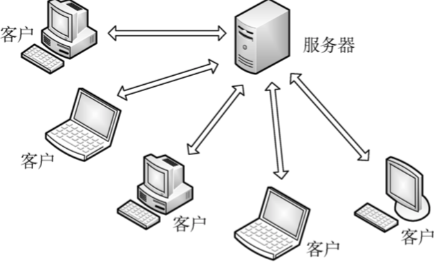

**服务器**：提供计算服务的设备

特点：

+ 永久提供服务
+ 永久性访问地址/域名

**客户端**：请求计算服务的主机

特点：

+ 与服务器通信，使用服务器提供的服务
+ 间歇性接入网络
+ 可能使用动态IP地址
+ 不与其他客户端直接通信

应用：Web， 文件传输FTP，远程登录，电子邮件

## 2.2 P2P模型(Peer-to-peer)

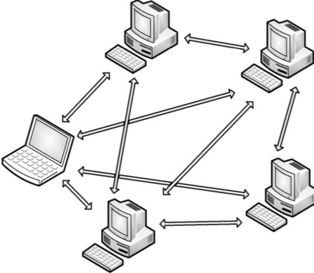

+ 不存在永远在线的服务器
+ 每个主机既可以提供服务，也可以请求服务
+ 任意端系统/节点之间可以直接通讯
+ 节点间歇性接入网络
+ 节点可以改变IP地址
+ 可扩展性好
+ 网络健壮性强

# 3、域名系统(DNS)

DNS服务的作用：将域名解析成IP地址

**域名**：

​			www.          google.      com

​			三级域名     二级域名    顶级域名

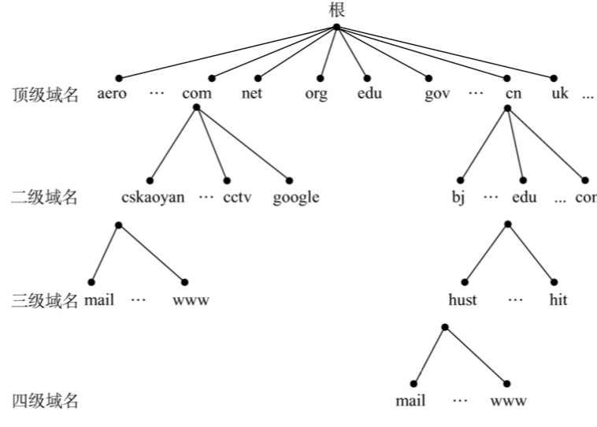

域名服务器：

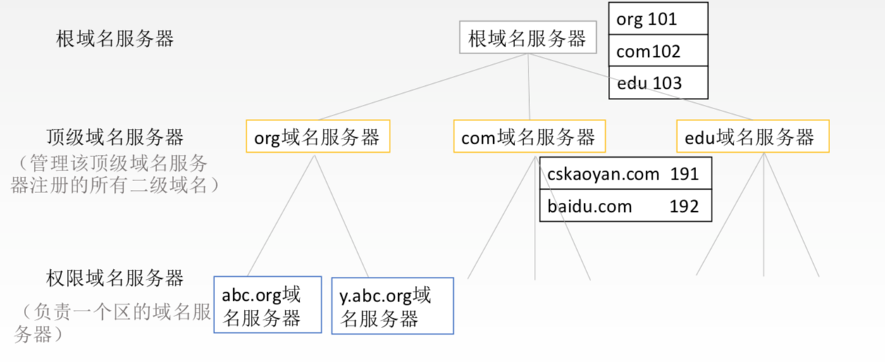

当一个主机发送DNS查询请求时，这个请求报文就是发给本地域名服务器

**域名解析过程**

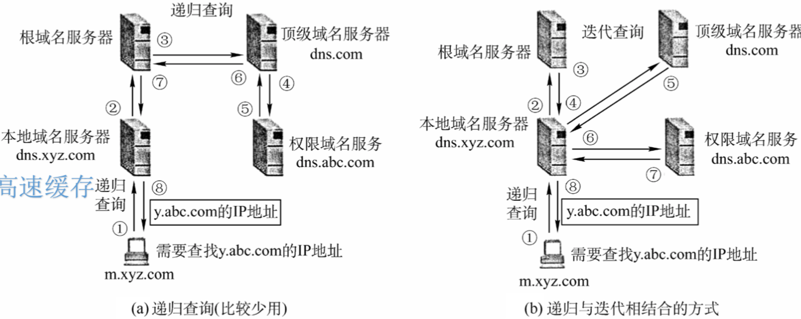

# 4、文件传输协议(FTP)

FTP是基于C/S的协议，用户通过一个客户机程序连接至在远程计算机上运行的服务器程序。

FTP服务器、FTP客户端

ftp 地址 用户名&密码  / 匿名用户 Anonymous

FTP使用**TCP实现可靠传输**

FTP工作原理：

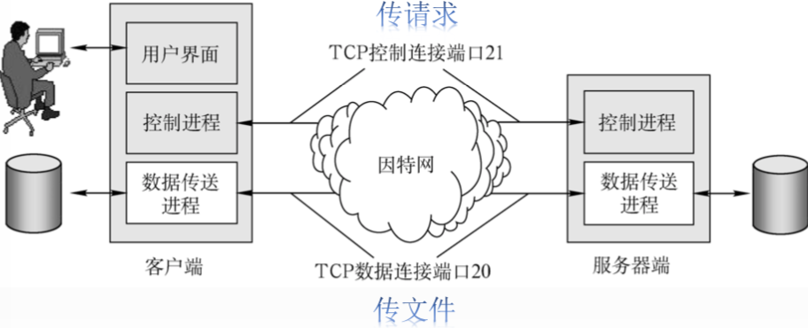

+ 控制连接始终保持
+ 数据连接保持一会儿
+ 是否使用TCP 20端口建立数据连接与传输模式有关
  + 主动方式使用TCP 20 端口
  + 被动方式由服务器和客户端自行协商(端口>1024)

# 5、电子邮件(E-mail)

## 5.1 电子邮件的信息格式

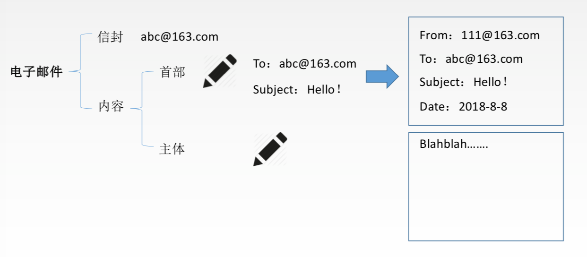

## 5.2 电子邮件系统-组成部分

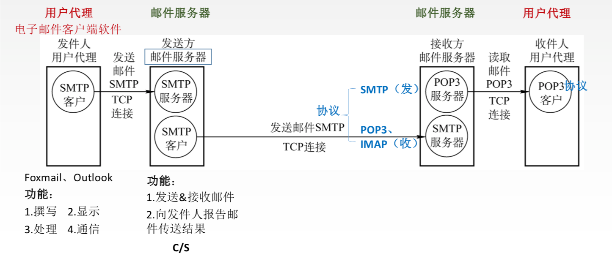

+ 用户代理
+ 邮箱服务器
+ 协议

## 5.3 简单邮件传送协议SMTP

+ SMTP规定了在两个相互通信的SMTP进程之间应如何交换信息
+ 负责发送邮件的SMTP进程就是SMTP客户，负责接收邮件的进程就是SMTP服务器。

+ SMTP规定了14条命令和21种应答信息

SMTP使用的TCP连接，端口号25，C/S 通信方式，通信分为三个阶段：

+ 建立连接
+ 邮件传送
+ 连接释放

SMTP的缺点：

+ SMTP不能传送可执行文件或者其他二进制对象
+ SMTP仅限传送7位ASCII码，不能传送其他非英语国家文字
+ SMTP服务器会拒绝超过一定长度的邮件

## 5.4 MIME

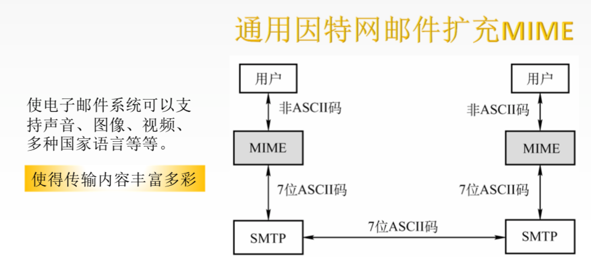

## 5.5 邮局协议POP3

TCP连接 端口号110 C/S

## 5.6 网际报文存取协议IMAP

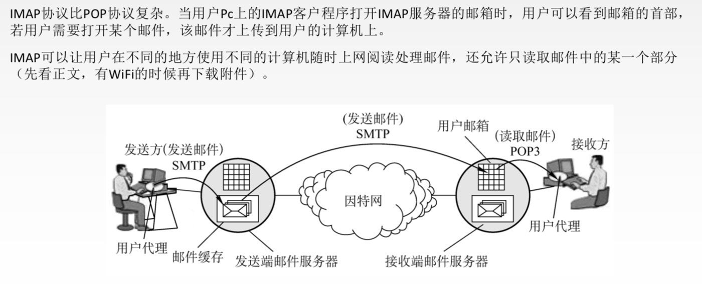

## 5.7 基于万维网的电子邮件

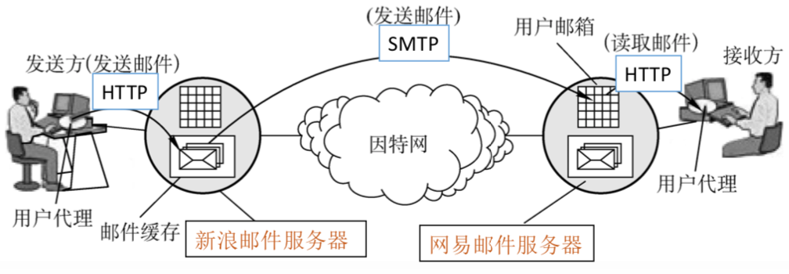

# 6、万维网(WWW)

## 6.1 万维网概述

万维网(WWW)是一个大规模、联机式的信息储藏所/资料空间，是无数个网络站点、网页的集合

统一资源定位符URL  —> 资源(文字、音频、视频)

URL一般格式：

<协议>://<主机>:<端口>/路径 

https://www.pku.edu.cn:443/index.html

## 6.2 超文本传输协议HTTP

### 6.2.1 HTTP 协议通信

HTTP协议定义了浏览器怎样向万维网服务器请求万维网文档，已经服务器怎样将文档传送给浏览器。

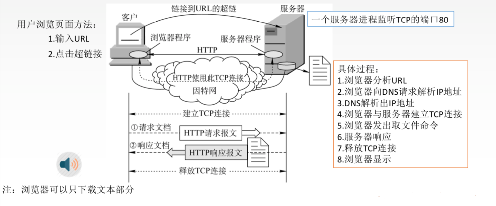

### 6.2.2 HTTP协议特点

HTTP协议是无连接的。

但是在实际工作中，一些网站希望能够是被用户—> cookie

cookie是存储在用户主机中的文本文件，记录一段时间内某用户的访问记录—> 提供个性化服务

HTTP采用TCP作为运输层协议，但HTTP协议本身是无连接的

HTTP的连接方式

+ 持久连接
  + 非流水线
  + 流水线
+ 非持久连接

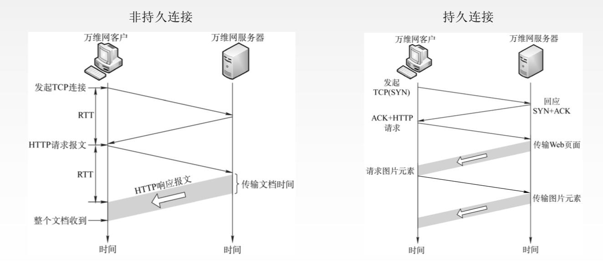

### 6.2.3 HTTP报文结构

HTTP报文是面向文本的，因此报文中的每一个字段都是一些ASCII码串

HTTP报文

+ 请求报文
+ 相应报文

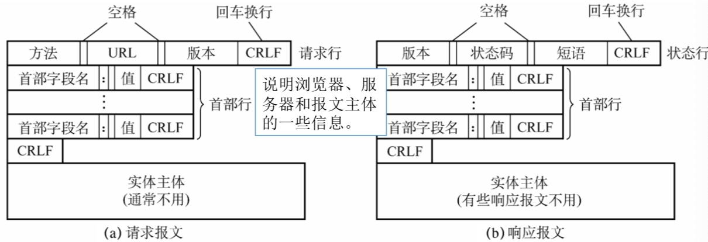

状态码：

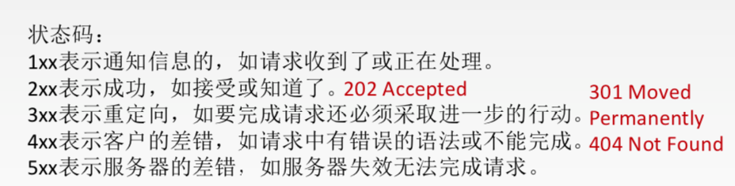