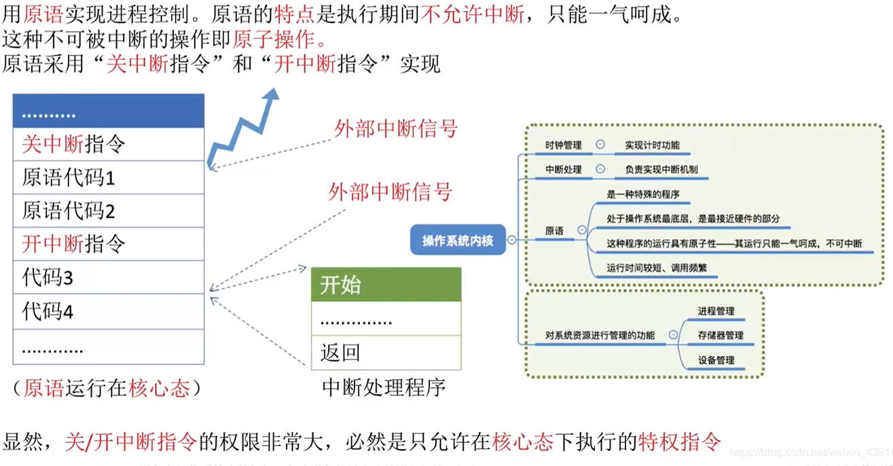

[TOC]

# 1 进程的定义/特征/组成和组织

## 1.1 进程的定义

### 1.1.1 程序的概念

程序就是一系列指令的集合

### 1.1.2 进程的概念

+ 系统为每个运行的程序分配一个数据结构，称为进程控制块（PCB），用来描述各种信息

+ PCB/程序段/数据段三部分构成了进程实体

### 1.1.3 进程的定义

程序段/数据段/PCB三部分组成了进程实体，一般情况下，我们把进程实体称为进程

引入了进程实体后，可以把进程定义为：

进程是进程实体的运行过程，是系统进行资源分配和调度的一个独立单位

> 进程和程序的区别和联系
>
> 区别：
>
> 1. 进程是动态的，程序是静态的概念
> 2. 进程有独立性，能够并发的执行，而程序不能
> 3. 二者无一一对应的关系，一个程序可以启动多个进程来完成
> 4. 组成不同：进程包含数据段/代码段/PCB，而程序包含指令和数据
> 5. 程序是一个包含了指令和数据的静态实体，本身除了占用磁盘空间外，不占用CPU和内存等运行资源，而进程会占有CPU和内存资源
>
> 联系：进程不能脱离具体程序而虚设，程序规定了相应进程要完成的动作

## 1.2 进程的特征

## 1.3 进程的组成

进程（进程实体）由程序段／数据段／PCB三部分组成

PCB是进程存在的唯一标志

PCB通常包含：

## 1.4 进程的组织

### 1.4.1 链接方式

### 1.4.2 索引方式

# 2 进程的状态

## 2.1 进程的状态

### 2.2.1 三种基本状态（就绪/运行/阻塞）

进程是程序的一次执行，操作系统将进程合理地分为几种状态

进程的三种基本状态：

+ 运行态：占有CPU，并在CPU上运行
+ 就绪态：已经具备运行条件，但由于没有空闲CPU，暂时不能运行（进程已经拥有了除处理机之外所有需要的资源，一旦获得处理机，即可立即进入运行态开始运行）
+ 阻塞态：因等待某一时间而暂时不能运行（如：等待操作系统分配打印机/等待读磁盘操作结果；CPU是计算机中最昂贵的部件，为了提高CPU的利用率，需要先将其他进程需要的资源分配到位，才能得到CPU的服务）

### 2.1.1 创建态和结束态

+ 创建态：进程正在被创建，操作系统为进程分配资源，初始化PCB
+ 结束态：进程正在从系统中撤销，操作系统回收进程拥有的资源/撤销PCB

## 2.2 进程状态之间的转化

进程一共有5中基本的状态，那么它们怎么实现转换呢？

# 3 进程控制原语

## 3.1 什么是进程控制

进程控制的主要功能是对系统中的所有进程实施有效的管理，它具有创建新进程/撤销已有进程/实现进程状态转换等功能

简化理解：反正进程控制就是要实现进程状态转换

## 3.2 使用原语对进程进行控制

> 调度和切换的区别：
>
> 调度是指决定资源分配给哪个进程的行为，是一种决策行为
>
> 切换是实际分配的行为，是执行行为
>
> 一般先有资源调度，后有进程切换

## 3.3 进程控制原语的共同点

进程控制会导致进程状态的切换，无论哪个原语，要做的无非三种事情：

+ 更新PCB中的信息（如修改进程状态标志/将运行环境保存到PCB/从PCB恢复运行环境）
  + 所有的进程控制原语一定都会修改进程状态标志
  + 剥夺当前运行进程的CPU使用权必然需要保存其运行环境
  + 某进程开始运行前必然要恢复运行环境
+ 将PCB插入适合的队列
+ 分配/回收资源

## 3.4 进程控制的五种原语

### 3.4.1 进程的创建原语

### 3.4.2 进程的终止原语

### 3.4.3 进程的唤醒和阻塞原语

+ 进程的阻塞和唤醒原语是成对存在的，必须成对使用
+ 阻塞原语是由被阻塞进程自我调用实现的
+ 唤醒原语是由一个被唤醒进程合作或被其他相关的进程调用实现的

### 3.4.4 进程的切换原语

# 4 进程间通信

## 4.1 什么是进程通信

## 4.2 共享内存

## 4.3 管道通信

## 4.4 消息传递

