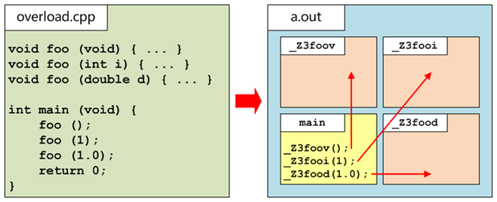

# １更好的Ｃ

+ C++ 和C一样，都属于编译型语言
+ C++ 和C一样，都属于强类型语言

+ C++对C完全兼容，对其做了优化并提供更多特性

  + 语言风格更加简洁

  + 类型检查更加严格

  + 支持面向对象编程

  + 支持操作符重载

  + 支持异常处理

  + 支持泛型编程

# 2 第一个C++程序

+ 编译器：g++
  + 也可以使用gcc，但是要加上-lstdc++
+ 扩展名：.cpp/.cc/.C/.cxx
  + 甚至也可以用.c
+ 头文件：#include <iostream>
  + usr/include/c++目录中
+ 流操作：cout << /  cin>>
  + 也可以scanf/printf
+ 所有标准类型/对象和函数都位于std名字空间中

```c++
/* 第一个C++程序 */
// hello.cpp
#include<iostream>

int main(int argc, char* argv[]) {
    std::cout << "Hello World!" << std::endl;
    return 0;
}
```

# 3 名字空间

## 3.1 为什么需要名字空间？

+ 划分逻辑单元
+ 避免名字冲突

```c++
// 划分逻辑单元
// module.cpp
#include <iostream>
//　数据转发程序
namespace NetWork {
    void recv( ) {
        std::cout << "recv data successful" << std::endl;
    }
    void send( ) {
        std::cout << "send data successful" << std::endl;
    }
}
namespace Compress { 
    void zip( ) {
        std::cout << "zip data successful" << std::endl;
    }
    void unzip( ) {
        std::cout << "unzip data successful" << std::endl;
    }
}
namespace EncryPt {
    void dsa( ) {
        std::cout << "dsa data successful" << std::endl;
    }
    void dec( ) {
        std::cout << "dec data successful" << std::endl;
    }
}
int main( int argc, char* argv[] ) {
    NetWork::recv( );
    Compress::unzip( );
    EncryPt::dec( );
    //------处理数据-----------
    EncryPt::dsa( );
    Compress::zip( );
    NetWork::send( );
    return 0;
}
```

```c++
// 避免名字冲突
// nameconf.cpp
#include <iostream>
namespace ICBC {
    int g_money = 0;

    void save( int money ) {
        g_money += money;
    }
    void pay( int money ) {
        g_money -= money;
    }
}
namespace CCB {
    int g_money = 0;

    void save( int money ) { // 连声明　带　定义
        g_money += money;
    }
    void pay( int money ); //声明
}
void CCB::pay( int money ) { //定义
    std::cout << "建行余额:" << CCB::g_money << std::endl;
}

int main( int argc, char* argv[] ) {
    ICBC::save( 10000 );
    ICBC::pay( 5000 );  
    std::cout << "工行余额:" << ICBC::g_money << std::endl;

    CCB::save( 8000 );
    CCB::pay( 2000 );
    std::cout << "建行余额:" << CCB::g_money << std::endl;
    return 0;
}
```

## 3.2 什么是名字空间

+ 名字空间定义
  + namespace 名字空间名 {...}
+ 名字空间合并
+ 名字空间分开

## 3.3 怎么使用名字空间

+ 作用域限定符
+ 名字空间指令
+ 名字空间申明

```c++
// diruse.cpp
#include <iostream>
using namespace std;
//名字空间指令
namespace ns {
    int g_value = 0;
}
//int g_value = 0;
using namespace ns;//从这行代码开始，ns名字空间中的内容在当前作用域可见.
int main( int argc, char* argv[] ) {
//    int g_value = 0;
//    using namespace ns;//从这行代码开始，ns名字空间中的内容在当前作用域可见.
    g_value = 100;
    /*std::*/cout << "ns::g_value=" << ns::g_value << /*std::*/endl;
    return 0;
}
```

```c++
// impname.cpp
#include <iostream>
using namespace std;

//名字空间声明

namespace ns {
    int g_value = 0;
}

//int g_value = 0;
using ns::g_value;//从这行代码开始，将ns名字空间中的g_value引入当前作用域
int main( int argc, char* argv[] ) {
//  int g_value = 0;
//  using ns::g_value;//从这行代码开始，将ns名字空间中的g_value引入当前作用域
    g_value = 100;
    cout << "ns::g_value=" << ns::g_value << endl;
    return 0;
}
```

问：名字空间声明和名字空间指令有什么区别？

```cpp
// dclhide.cpp
#include <iostream>
using namespace std;
//体会　名字空间指令　　和　名字空间声明的　差别

namespace ns1 {
    int g_value = 0;
    int g_other = 0;
}
namespace ns2 {
    int g_value = 0;
    int g_other = 0;
}

int main( int argc, char* argv[] ) {
    using namespace ns1;// 名字空间指令,仅仅将ns1中的所有标识符在当前作用域可见
    using ns2::g_value;// 名字空间声明,将ns2中的g_value引入当前作用域(相当于定义)
                       // 仅仅只有g_value引入当前作用域
    g_value = 100;
    cout << "ns1::g_value=" << ns1::g_value << endl;
    cout << "ns2::g_value=" << ns2::g_value << endl;    
    
    g_other = 200;
    cout << "ns1::g_other=" << ns1::g_other << endl;
    cout << "ns2::g_other=" << ns2::g_other << endl;    
    
    return 0;
}
```

## 3.4 名字空间嵌套和别名

+ 内层标识符隐藏外层同名标识符

+ 嵌套的名字空间需要逐层分解
+ 通过名字空间别名简化书写

```c++
// netstalias.cpp
#include <iostream>
using namespace std;

namespace ns1 {
    int g_value = 0;
    namespace ns2 {
        int g_value = 0;
        namespace ns3 {
            int g_value = 0;
            namespace ns4 {
                int g_value = 0;
            }
        }
    }
}

int main( int argc, char* argv[] ) {
    namespace ns_four = ns1::ns2::ns3::ns4;
    ns_four::g_value = 100;
    cout << ns_four::g_value << endl;
    return 0;
}
```

# 4 结构/联合/枚举/布尔

+ C++的结构
  + 定义结构型变量时，可以省略struct关键字
  + 可以定义成员函数，在结构体中的成员函数中可以直接访问该结构体的成员变量，无需通过“.”或“->”

+ C++的联合

  + 定义联合型变量时，可以省略union关键字

  + 支持匿名联合

+ C++的枚举

  + 定义枚举型变量时，可以省略enum关键字
  + 独立的类型，和整型之间不能隐式转换.

+ C++布尔类型
  + bool，true表示真，false表示假
  + 任何基本类型都可以被隐式转换为布尔类型（非0即真，0即假）

```c++
// type.cpp
#include <iostream>
#include <cstring>
using namespace std;

struct Student {
    int m_age; // 成员变量
    char m_name[256]; // 成员变量
    void getinfo( ) { // 成员函数
        cout << "姓名:" << m_name << ", 年龄:" << m_age << endl;
    }
};

void Struct() {
    /*struct*/ Student s;
    s.m_age = 22;
    strcpy( s.m_name,"张飞" );
    s.getinfo( );
//  cout << "姓名:" << s.m_name << ", 年龄:" << s.m_age << endl;
}

void Union( ) {
    union {
        int i;
        char c[4];
    };
    i = 0x12345678;
    cout << hex << (int)c[0] << ' ' << (int)c[1] << ' ' << (int)c[2] 
         << ' ' << (int)c[3] << endl;
}

enum Color { red=5, green=10, blue=15 };
void Enum( ) {
    /*enum*/ Color c = red; // 0,error
    cout << c << endl;
}

void Bool( ) {
    bool bTrue = "";//"fdsfds";//0.00000001;//true;
    bool bFalse = NULL;//0.0000000;//false;
    cout << "bTrue=" << bTrue << ", bFalse=" << bFalse << endl;
}
int main( int argc, char* argv[] ) {
    Bool( );
//  Enum( );
//  Union( );
//  Struct( );
    return 0;
}
```

# 5 重载

## 5.1 重载关系

+ 同一作用域内，函数名相同，参数表不同

+ 根据实参的类型进行匹配并调用最匹配的函数

+ 只有同一内同名函数才涉及不同

```c++
// overload.cpp
#include <iostream>
using namespace std;

void foo( char* c, short s ) {
    cout << "1:foo(char*,short)" << endl;
}

void foo( double d, int i ) {
    cout << "2:foo(double,int)" << endl;
}

void foo( const char* c, short s ) {
    cout << "3:foo(const char*, short)" << endl;
}

void foo( int d, double i ) {
    cout << "4:foo(int,double)" << endl;
}

//int foo( int d, double i ) {} //error,和返回值类型无关
//void foo( int i, double d ) {}　//error,和第４个版本的foo参数表完全相同

int main( int argc, char* argv[] ) {
    char* c;  short s;
    foo( c, s );
    const char* cc;
    foo( cc, s );
    int i;  double d;
    foo( i, d );
    foo( d, i );
    return 0;
}
```

```c++
// overload2.cpp
#include <iostream>
using namespace std;
namespace ns1 {
    void foo( char* c, short s ) {
        cout << "1:foo(char*,short)" << endl;
    }

    void foo( double d, int i ) {
        cout << "2:foo(double,int)" << endl;
    }
}
namespace ns2 {
    void foo( const char* c, short s ) {
        cout << "3:foo(const char*, short)" << endl;
    }

    void foo( int d, double i ) {
        cout << "4:foo(int,double)" << endl;
    }
}

int main( int argc, char* argv[] ) {
    using namespace ns1;//可见表
    using ns2::foo;　//定义表
    char* c;    short s;
    foo( c, s );
    return 0;
}
```

## 5.2 重载解析

+ 完全匹配>常量转换>升级转换>标准转换>自定义转换>省略号匹配

+ 函数指针的类型决定其匹配的重载版本

```c++
// overload3.cpp
#include <iostream>
using namespace std;

void foo( char* c, short s ) {
    cout << "1: foo(char*, short)" << endl;
}
void foo( const char* c, short s ) {
    cout << "2: foo(const char*, short)" << endl;
}
void foo( char* c, int s ) {
    cout << "3: foo(char*, int)" << endl;
}
void foo( char* c, char s ) {
    cout << "4: foo(char*, char)" << endl;
}
void foo( ... ) {
    cout << "5: foo(...)" << endl;
}
int main( int argc, char* argv[] ) {
    char* c;   short s;
    foo( c, s ); // 实参类型决定调用哪个

    void(*pFunc)(const char*, short) = foo; // 函数指针的类型决定调用哪个
    pFunc( c, s );
    return 0;
}
```

## 5.3 重载的实现

+ 重载是通过C++换名机制来实现的



+ 通过extern “C”可以要求C++编译器按照C方式编译函数，即不做换名，当然也就无法重载

```c++
// extern.cpp
#ifndef __INCvxWorksh /*防止该头文件被重复引用*/
#define __INCvxWorksh
#ifdef __cplusplus             //告诉编译器，这部分代码按C语言的格式进行编译，而不是C++的
extern "C"{
#endif
 
/*…*/
 
#ifdef __cplusplus
}
 
#endif
#endif /*end of __INCvxWorksh*/
```

## 5.4 缺省参数

+ 可以为函数的形参指定缺省（默认）值，当调用该函数时若未指定实参，则使用形参的缺省值。

+ 如果函数的某一个形参具有缺省（默认）值，那么该形参后面的所有形参必须都具有缺省（默认）值

+ 尽量避免因为使用缺省参数而导致重载匹配歧义

+ 函数形参的缺省（默认）值只能在函数声明中指定

```c++
// defparam.cpp
#include <iostream>
using namespace std;

void foo( int a, double b=3.14, float c=3.1, short d=3, char e='m' );//声明

void foo( int a ) {
}

int main( int argc, char* argv[] ) {
    foo( 6, 6.28, 6.2, 3 );
    foo( 6, 6.28, 3 );
//  foo( 6 );
    return 0;
}

void foo( int a, double b, float c, short d, char e ) { // 定义
    cout << a << ' ' << b << ' ' << c << ' ' << d << ' ' << e << endl;
}

```

## 5.5 哑元

只指定形参类型而不指定形参名称的函数，称为哑元

+ 保证函数向下兼容
+ 形参函数的重载版本

```c++
// forover.cpp
#include <iostream>
using namespace std;
//哑元
void foo( int ) {
    // ....
    cout << "foo()" << endl;
}
void foo( ) {
}
//模拟库
//--------------------
//模拟程序员
int main( int argc, char* argv[] ) {
    foo( 10 );
    return 0;
}
```

# 6 内联函数

+ 调用普通函数的问题：

  每个普通函数调用语句都需要发生跳转操作，这种跳转操作会带来时间开销。

+ 内联就是用函数已被编译好的二进制代码，替换对该函数的调用指令

+ 内联在保证函数特性的同时，避免了函数调用的时间开销

问：内联与有参宏(宏函数)的区别

```c++
// inline.cpp
#include <iostream>
using namespace std;

void foo( int x ) {
    cout << "foo(int):" << x << endl;
}

inline void bar( int x ) {
    cout << "bar(int):" << x << endl;
}

#define PRINT(X) cout << "PRINT(int):" << X << endl;

int main( int argc, char* argv[] ) {
    foo( 10 ); // 生成跳转指令
    foo( 20 ); // ...
    foo( 30 ); // ...

    bar( 10 ); // 将此处的调用替换为bar函数编译后的二进制代码
    bar( 20 ); // ...
    bar( 30 ); // ...

    PRINT( 10 ); // 预编译阶段，对宏做纯文本替换
    PRINT( 20 );
    PRINT( 30 );
    return 0;
}
```

+ 内联会使可执行文件的体积和进程代码的内存变大，因此只有频繁调用的简单函数才适合内联

+ inline关键字仅表示期望该函数被优化为内联，但是否适合内联则完全由编译器决定

+ 稀少被调用的复杂函数和递归函数都不适合内联

# 7 动态内存分配

+ 可以继续使用标准C库函数malloc/free
+ 更建议使用new/delete**操作符**在堆中分配/释放内存

+ 在分配内存的同时初始化
  + int* pi = new int(100);
+ 以数组方式new的要以数组方式delete
  + int* pi = new int[4]{10,20,30,40};
  + delte[] pi;

+ 通过new操作符分配N维数组，返回N-1维数组指针
  + int (*prow) [4] = new int [3][4];
  + int (*ppage) [4][5] = new int [3][4][5];

+ 不能通过delete操作符释放已释放过的内存

+ delete野指针后果未定义，delete空指针安全

+ new操作符申请内存失败，将抛出bad_alloc异常

```c++
// new.cpp
#include <iostream>
#include <cstdlib>
using namespace std;


int main( int argc, char* argv[] ) {
    int* pm = (int*)malloc( 4 );
    cout << "*pm=" << *pm << endl;
    free( pm );
    pm = NULL;
    free( pm );

    int* pn = new int(100);
    cout << "*pn=" << *pn << endl;
    delete pn;
    pn = NULL; //　好习惯
    delete pn;

    int* parr = new int[4]{10,20,30,40}; //返回值为第一个元素的地址
    for( int i=0; i<4; i++ )
        cout << parr[i] << ' ';
    cout << endl;
    delete[] parr;

    int(*p)[4] = new int[3][4];
    delete[] p;

    new int[0xFFFFFFFF];
    return 0;
}
```

# 8 引用

+ 引用时内存的别名，对引用的操作就是对目标内存的操作
+ 引用本身不占内存，并非实体
+ 引用必须初始化，且不能更换目标

+ 不存在引用的引用
+ 引用的常属性需和目标常属性一致

```c++
const int e = 10;
int& f = e; // Error
const int& g = e; // OK

int a = 10;
const int& h = a; // OK
```

```c++
// lrvalue.cpp
#include <iostream>
using namespace std;

int foo( ) {
    int a = 1000;
    return a;
}
int main( int argc, char* argv[] ) {
//当前作用域的生命期
//具名内存-->能够取址-->左值|非常左值(无const修饰)
//                          |常左值　(有const修饰)
    int a;
    &a;
    a = 100;
    const int b = 10;
    &b; 
//  b = 100; // error

//语句级的生命期
//匿名内存-->不能取值-->右值|右值天然不可更改(98/03这么认为)
    10;
//  &10; // error
//  10 = 15;

    foo();
//  &foo(); // error
//  foo()=100;
    return 0;
}
```

```c++
// alias.cpp
#include <iostream>
using namespace std;

int main( int argc, char* argv[] ) {
    int a = 10;
    int& b = a;//这并不是赋值，而是在初始化引用ｂ(b是ａ代表的内存的别名)
    b = 20; // 更改引用ｂ的值，其实更改的为ｂ引用的目标内存(a)的值
    cout << "a=" << a << ", b=" << b << endl;
    //读取引用ｂ的值，其实读取的为引用的目标内存（ａ）的值
    cout << "&a:" << &a << ", &b:" << &b << endl;
    //取引用ｂ的地址，其实取的为引用的目标内存（ａ）的地址

    int c = 30;
    b = c; // 将ｃ的值赋值给引用的目标内存(a)
    cout << "a=" << a << ", b=" << b << ", c=" << c << endl;
    cout << "&a:" << &a << ", &b=" << &b << ", &c:" << &c << endl;

    int& d = b; 
    cout << "&a:" << &a << ", &b:" << &b << ",&d:" << &d << endl;

    const int e = 100;
//    int& f = e;
    const int& g = e; // 引用的类型必须和目标内存的常属性一致

    const int& h = a; //　但可以限定更加严格
    return 0;
}
```

+ 引用可以延长右值的生命周期

+ 常引用即万能引用
+ 引用周期不能长于目标

```c++
#include <iostream>
using namespace std;
int foo( ) {
    int a = 1000;
    return a;
}
int main( int argc, char* argv[] ) {
//当前作用域的生命期
//具名内存-->能够取址-->左值|非常左值(无const修饰)
//                          |常左值　(有const修饰)
    int a;
    int& ra = a;
    const int& cra = a;

    const int b = 10;
    const int& crb = b;
//语句级的生命期
//匿名内存-->不能取值-->右值|右值天然不可更改(98/03这么认为)
    const int& ri = 10;
    const int& rf = foo();
    return 0;
}
```

+ 引用型参数，函数的形参是实参的别名
  + 在函数中修改实参值
  + 避免对象复制的开销 

+ 常引用型参数
  + 防止对实参的意外修改 

  + 接受常量型实参

```c++
#include <iostream>
using namespace std;

void Swap( int& x, int& y ) {
    int tmp = x;
    x = y;
    y = tmp;
}

void Swap( int* x, int* y ) {
    int tmp = *x;
    *x = *y;
    *y = tmp;
}

void Print( const int& x,const int& y ) {
//  x = 10000;
    cout << x << ' ' << y << endl;
}
int main( int argc, char* argv[] ) {
    int a=10, b=20;
    Swap( a, b );   
//  Swap( &a, &b );
    Print( a, b );
//  cout << "a=" << a << ", b=" << b << endl;
    
    Print( 1000, 2000 );
    return 0;
}
```

+ 引用型的返回值，从函数中返回引用，一定要保证在函数返回以后，该引用的目标依然有效
  + 可以返回全局、静态变量的引用
  + 可以返回成员变量的引用
  + 可以返回在堆中动态创建的对象的引用
  + 可以返回调用对象自身的引用
  + 可以返回引用型参数本身
  + 不能返回局部变量的引用

+ 非常引用型返回值
  + 通过引用可以修改目标

+ 常引用型返回值
  + 通过引用不能修改目标

```c++
#include <iostream>
using namespace std;
//　引用型返回值
int g_value = 0;
int& foo() {
    return g_value;
}
const int& fooo() {
    return g_value;
}

int& bar() {
    static int s_value=0;
    cout << "s_value=" << s_value << endl;
    return s_value;
}
int& hum() {
    int* pn = new int;
    return *pn;
}

int& fun( int& x ) {
    return x;
}

int& hoo( ) {
    int a = 0;
    return a;
}
int boo( ) {
    int a = 0;
    return a;
}
int main( int argc, char* argv[] ) {
    foo( ) = 100; //１生成跳转指令, 2 foo()代表引用
    fooo( ) = 8000;
    cout << "g_value=" << g_value << endl;
    bar( ) = 200;
    bar( );
    hum( ) = 300;
    int a=0;
    fun( a ) = 400;
    cout << "a=" << a << endl;
//  hoo( ); // error         |注意体会两者的差别
    const int& rb = boo( );//|
    return 0;
}
```

+ 在实现层面，引用就是指针，但在C++语言层面，引用不是实体类型，因此C++语言层面引用与指针存在明显的差别
  + 指针可以不初始化，其目标可在初始化后随意变更(除非是指针常量)，而引用必须初始化，且一旦初始化就无法变更其目标
  + 存在空指针，不存在空引用
  + 存在指向指针的指针，不存在引用的引用

  + 存在指针的引用，不存在引用的指针

  + 存在指针数组引用，不存在引用数组，但存在数组引用

  

# 9 类型转换

+ C风格的显式类型转换
  + (目标类型)源类型变量

+ C++风格的显式类型转换
  + 目标类型(源类型变量)

+ 静态类型转换
  + static_cast<目标类型> (源类型变量)
  + 隐式类型转换的逆转换
  + 自定义类型转换

+ 动态类型转换
  + dynamic_cast<目标类型> (源类型变量)
  + 多态父子类指针或引用之间的转换

+ 常类型转换

  + const_cast<目标类型> (源类型变量)

  + 去除指针或引用上的const属性

+ 重解释类型转换
  + reinterpret_cast<目标类型> (源类型变量)
  + 任意类型的指针之间的转换或引用之间的转换
  + 任意类型的指针和整型之间的转换

