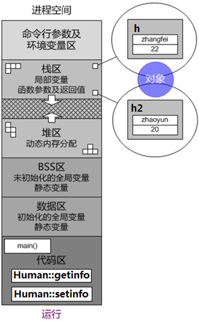

# 1 面向对象基本概念

## 1.1 什么是面向对象（what）

## 1.2 为什么要面向对象(why)

## 1.3 怎么面向对象（how）


# 2 类和对象

+ 类是抽象事物的一套规则

+ 类是一种用户自定义的复合数据类型，即包括表达属性的**成员变量**，也包括表达行为的**成员函数**

+ 类可用于表达那些不能直接与内置基本类型建立自然映射关系的**逻辑抽象**

+ 类是现实世界的**抽象**，对象是类在虚拟世界的**实例**


类的定义：


访问控制限定符：

+ public
  + 共有成员，谁都可以访问
+ protected
  + 保护成员，只有自己和子类可以访问
+ private
  + 私有成员，只有自己可以访问

+ 在C++中，类(class)和结构(struct)已没有本质性的差别，唯一的不同在于
  + 类的缺省访问控制属性为私有(private)
  + 结构的缺省访问控制属性为公有(public)

+ 访问控制限定符仅作用于类，而非作用于对象。

+ 对不同成员的访问控制属性加以区分，体现了C++作为面向对象程序设计语言的封装特性

```c++
// 01class.cpp
#include <iostream>
#include <cstring>
using namespace std;
//类
//struct
class Human {
public:
    void setinfo( int age=0, const char* name="无名" ) {
        if( !strcmp(name,"小二") ) {
            cout << "你才二呢" << endl;
            return;
        }
        m_age = age;
        strcpy( m_name, name );
    }
    void getinfo( ) {
        cout << "姓名:" << m_name << ", 年龄:" << m_age << endl;
    }
private:
    int m_age;
    char m_name[256];
};

int main( int argc, char* argv[] ) {
    Human h;//定义h对象(分配内存空间)
            //在h所占据内存空间中,定义m_age(分配内存空间)初值为随机数
            //在h所占据内存空间中,定义m_name(分配内存空间)初值为随机数
    cout << "h对象的大小:" << sizeof(h) << endl;
    h.setinfo( 22, "张飞" );
    h.setinfo( 22, "小二" );
//  h.m_age = 22;
//  strcpy( h.m_name, "张飞" );
//  strcpy( h.m_name, "小二" );
    h.getinfo( );
//  cout << "姓名:" << h.m_name << ", 年龄:" << h.m_age << endl;
    return 0;
}
```

# 3 this指针



+ 同一个类的不同对象各自拥有独立的成员变量。

+ 同一个类的不同对象彼此共享同一份成员函数。

+ 在代码区中，同一个类的不同对象所共享的成员函数，

  这些成员函数内部，如何区分所访问的成员变量隶属于哪个对象？

+ 类的每个成员函数(除静态成员函数外)，都有一个隐藏的指针型参数this，指向调用该成员函数的对象，这就是this指针
+ 在类的成员函数中（除静态成员函数外），对所有成员的访问，都是通过this指针进行的

```c++
// 02this.cpp
#include <iostream>
#include <cstring>
using namespace std;
class Human {
public: //_ZN5Human7setinfoEiPKc
    void setinfo(/* Human *this*/ int age=0, const char* name="无名" ) {
        this->m_age = age;
        strcpy( this->m_name, name );
    }
    void getinfo( /* Human *this */ ) { // _ZN5Human7getinfoEv
        cout << "姓名:" << this->m_name << ", 年龄:" << this->m_age<<endl;
    }
private:
    int m_age;
    char m_name[256];
};
int main( int argc, char* argv[] ) {
    Human h;
    cout << "h对象的大小:" << sizeof(h) << endl;
    h.setinfo( 22, "zhangfei" );//_ZN5Human7setinfoEiPKc(&h,22,"zhangfei");
    h.getinfo( ); //_ZN5Human7getinfoEv(&h);

    Human h2;
    cout << "h2对象的大小:" << sizeof(h2) << endl;
    h2.setinfo( 20, "zhaoyun" );//_ZN5Human7setinfoEiPKc(&h2,20,"zhaoyun");
    h2.getinfo( ); //_ZN5Human7getinfoEv(&h2);
    return 0;
}
```


## 3.1 this指针的应用

+ 多数情况下，程序并不需要显式地使用this指针

+ 有时为了方便，将一个类的某个成员变量与该类成员函数的相应参数取相同标识符，这时在成员函数内部，可通过this指针将二者加以区分

+ 返回基于this指针的自引用，以支持串连调用

+ 将this指针作为函数的参数，以实现对象交互

```cpp
// 03hastothis.cpp
#include <iostream>
using namespace std;
class Integer {
public:
    void setinfo(/* Integer* this */ int i ) {
        this->i = i;
    }
    void getinfo(/*Integer* this */) {
//        cout << i << endl;
        Print( *this );
    }
    Integer& increment(/* Integer* this */) {
        i += 1;
        return *this;
    }
private:
    int i; //m_
    friend void Print( Integer vx );//友元
};
void Print( Integer vx ) {
    cout << vx.i << endl;
}
int main( int argc, char* argv[] ) {
    Integer ix;
    ix.setinfo( 100 );
    ix.getinfo( );
    ix.increment().increment().increment(); 
    ix.getinfo();
    return 0;
}
```

## 3.2 常函数和常对象

+ 被const关键字修饰的对象、对象指针或对象引用，统称为常对象

+ 在类成员函数的形参表之后，函数体之前加上const关键字，该成员函数的this指针即具有常属性，这样的成员函数被称为常函数

```c++
class 类名 {
     返回类型 函数名 (形参表) const {
         函数体;
     }
 };
```

+ 在常函数内部无法修改成员变量的值，除非该成员变量被mutable关键字修饰

+ 原型相同的成员函数，常版本和非常版本构成重载

  + 常对象只能选择常版本

  + 非常对象优先选择非常版本，如果没有非常版本，也能选择常版本

```c++
const User user;
const User* cptr = &user;
const User& cref = user;
```

```c++
// 04usethis.cpp
#include <iostream>
using namespace std;
class Integer {
public:
    void setinfo(/* Integer* this */ int i ) { //非常函数
        this->i = i;
    }
    void getinfo(/* const Integer* this */) const {//常函数
        const_cast<Integer*>(this)->i = 1000000;
        cout << "常函数:" << i << endl;
    }
    void getinfo( /* Integer* this */ ) { //非常函数
        cout << "非常函数:" << i << endl;
    }
private:
    /*mutable*/ int i; //m_
};
int main( int argc, char* argv[] ) {
    Integer ix;
    ix.setinfo( 1000 ); //setinfo(&ix, 1000);
    ix.getinfo( ); // getinfo( &ix ); --->参数类型为Integer*

    const Integer cix = ix;
    cix.getinfo( ); // getinfo( &cix ); --->参数类型为const Integer*
    return 0;
}
```

# 4 类的定义与实例化

+ 构造函数
  + 构造函数函数名必须与类名相同，且没有返回类型
+ 构造函数调用时间
  + 在定义对象同时自动被调用，且仅被调用一次
    + 对象定义语句
    + new操作符
+ 构造函数作用
  + 定义对象的各个成员变量并赋初值。设置对象的初始状态
  + 在对象定义之初想实现的任何操作

+ 对象的定义过程
  + 为整个对象分配内存空间
  + 以构造实参调用构造函数
    + 定义成员变量
    + 执行构造代码

```c++
// 05clsobj1.cpp
#include <iostream>
#include <cstring>
using namespace std;
class Human {
public:
    Human(/* Human* this */ int age=0, const char* name="无名" ) {
        //在this所指向内存空间中,定义m_age(分配内存空间)初值为随机数
        //在this所指向内存空间中,定义m_name(分配内存空间)初值为随机数
        cout << "姓名:" << m_name << ", 年龄:" << m_age << endl;
        m_age = age;
        strcpy( m_name, name );
    }
/*  void setinfo( int age=0, const char* name="无名" ) {
        m_age = age;
        strcpy( m_name, name );
    }*/
    void getinfo( ) {
        cout << "姓名:" << m_name << ", 年龄:" << m_age << endl;
    }
private:
    int m_age; //声明
    char m_name[256]; //声明
};

int main( int argc, char* argv[] ) {
    Human h(22,"张飞");//定义h对象(分配内存空间),并利用h.Human(22,"张飞");
    cout << "h对象定义完毕" << endl;
//  h.setinfo( 22, "张飞" );
    h.getinfo( );
    return 0;
}
```

类的声明和实现可以分开：

```c++
class 类名 {
    返回类型 函数名 (形参表);
};

返回类型 类名::函数名 (形参表) {
    函数体;
}

```

```c++
// 06clsobj2.cpp
#include <iostream>
#include <cstring>
using namespace std;
class Human {
public:
    Human(/* Human* this */ int age=0, const char* name="无名" );//声明
    void getinfo( ); // 声明
private:
    int m_age; //声明
    char m_name[256]; //声明
};

Human::Human(/* Human* this */ int age, const char* name ) {
    //在this所指向内存空间中,定义m_age(分配内存空间)初值为随机数
    //在this所指向内存空间中,定义m_name(分配内存空间)初值为随机数
    m_age = age;
    strcpy( m_name, name );
}

void Human::getinfo( ) {
    cout << "姓名:" << m_name << ", 年龄:" << m_age << endl;
}

int main( int argc, char* argv[] ) {
    Human h(22,"张飞");//定义h对象(分配内存空间),并利用h.Human(22,"张飞");
    h.getinfo( );
    return 0;
}

```

对象的定义和销毁：

+ 在栈中定义单个对象

  ```c++
  类名 对象; // 注意不要加空括号
  类名 对象 (实参表);
  ```

+ 在栈中定义对象数组

  ```c++
  类名 对象数组[元素个数];
  类名 对象数组[元素个数] = {类名 (实参表), ...};
  类名 对象数组[] = {类名 (实参表), ...};
  ```

+ 在堆种定义/销毁单个对象

```c++
类名* 对象指针 = new 类名;
类名* 对象指针 = new 类名 ();
类名* 对象指针 = new 类名 (实参表);
delete 对象指针;
```

+ 在堆中定义/销毁对象数组

```c++
类名* 对象数组指针 = new 类名[元素个数];
类名* 对象数组指针 = new 类名[元素个数] {类名 (实参表), ...};// 上面的写法需要编译器支持C++11标准delete[] 对象数组指针;
```

```c++
// 07clsobj3.cpp
#include <iostream>
#include <cstring>
using namespace std;
class Human {
public:
    Human(/* Human* this */ int age=0, const char* name="无名" );//声明
    void getinfo( ); // 声明
private:
    int m_age; //声明
    char m_name[256]; //声明
};

Human::Human(/* Human* this */ int age, const char* name ) {
    //在this所指向内存空间中,定义m_age(分配内存空间)初值为随机数
    //在this所指向内存空间中,定义m_name(分配内存空间)初值为随机数
    m_age = age;
    strcpy( m_name, name );
}

void Human::getinfo( ) {
    cout << "姓名:" << m_name << ", 年龄:" << m_age << endl;
}

int main( int argc, char* argv[] ) {
    Human(60, "黄忠").getinfo();
    //定义匿名对象，利用匿名对象.Human(60,"黄忠")

    Human h(22,"张飞");//定义h,并利用h.Human(22,"张飞");
    h.getinfo( );

    Human h2; //定义h2,并利用h2.Human();
    h2.getinfo( );

    Human h3[3];
    for( int i=0; i<3; i++ )
        h3[i].getinfo( );

    Human h4[3] = { Human(22,"张飞"), Human(20,"赵云"), Human(25,"关羽") };
    for( int i=0; i<3; i++ )
        h4[i].getinfo( );

    Human h5[] = { Human(22,"张飞"), Human(20,"赵云"), Human(25,"关羽") };
    for( int i=0; i<sizeof(h5)/sizeof(h5[0]); i++ )
        h5[i].getinfo( );

    Human* ph = new Human; // 定义Human对象,并利用Human对象.Human()
    ph->getinfo( );
    delete ph;
    ph = NULL;

    Human* ph2 = new Human();
    ph2->getinfo( );
    delete ph2;
    ph2 = NULL;

    Human* ph3 = new Human(22, "张飞");
        // 定义Human对象,并利用Human对象.Human(22,"张飞")
    ph3->getinfo( );
    delete ph3;
    ph3 = NULL;

    Human* ph4 = new Human[3];
    for( int i=0; i<3; i++ )
        ph4[i].getinfo( );
    delete[] ph4;
    ph4 = NULL;

Human*ph5=new Human[3]{Human(22,"张飞"),Human(20,"赵云"),Human(25,"关羽")};
    for( int i=0; i<3; i++ )
        ph5[i].getinfo( );
    delete[] ph5;
    ph5 = NULL;
    return 0;
}
```

将类的声明/实现和使用分别放在不同的文件：

```c++
// 08divided
// Human.h
#ifndef __HUMAN_H
#define __HUMAN_H

class Human {
public:
    Human( int age=0, const char* name="无名" );
    void getinfo( );
private:
    int m_age; 
    char m_name[256];
};

#endif
```

```c++
// Human.cpp
#include "Human.h"
#include <cstring>
#include <iostream>
using namespace std;
Human::Human( int age/*=0*/, const char* name/*="无名"*/ ) {
    m_age = age;
    strcpy( m_name, name );
}

void Human::getinfo( ) {
    cout << "姓名:" << m_name << ", 年龄:" << m_age << endl;
}
```

```c++
// main.cpp
#include "Human.h"

int main( int argc, char* argv[] ) {
    Human h(22,"张飞");
    h.getinfo( );
    return 0;
}
```


# 5 string

```c++
// 09string.cpp
#include <iostream>
using namespace std;
//C++标准库中封装了一个字符串类 (string类有一个成员变量char* m_psz)
int main( int argc, char* argv[] ) {
    string s1("hello");
    //定义s1,并利用s1.string("hello")-->s1维护一个字符串"hello"
    cout << s1.c_str() << endl;
    cout << s1 << endl;

    string s2 = s1; //(s1)
    //定义s2,并利用s2.string(s1)-->s2维护一个字符串和s1维护的字符串相同
    cout << s2.c_str() << endl;
    cout << s2 << endl;

    string s3; // 定义s3,并利用s3.string()--->s3维护一个字符串"\0"
    cout << s3.c_str() << endl;
    cout << s3 << endl;
    s3 = s2; // s3.operator=(s2)--->s3维护一个字符串和s2维护的字符串相同
    cout << s3.c_str() << endl;
    cout << s3 << endl;

    string s4 = "hello";
    //集合 s1 和 s2 的操作（效率不高）-->s4维护一个字符串"hello"
    cout << s4.c_str() << endl;
    cout << s4 << endl;

    string s5;
    s5 = "hello"; 
    // 步骤和s1相同    s3第2步相同(效率不高)-->s5维护一个字符串"hello"
    cout << s5.c_str() << endl;
    cout << s5 << endl;
    return 0;
}
```

# 6 构造函数

+  构造函数可以重载
  + 构造函数也可以通过**参数表**的差别化形成重载
  + 重载的构造函数通过构造实参的类型进行匹配
  + 不同的构造函数版本表示不同的对象创建方式
  + 使用缺省参数可以减少构造函数重载版本数量

+ 构造函数分类
  + 多参构造函数：按多参方式构造
  + 无参(缺省)构造函数：按无参方式构造
  + 类型转换构造函数：利用不同类型的对象构造
  + 拷贝构造函数：利用相同类型的对象构造

```c++
// 10consover.cpp
#include <iostream>
using namespace std;

class Human {
public:
/*  Human( ) {
        m_age = 0;
        m_name = "无名";
    }
    Human( int age ) {
        m_age = age;
        m_name = "无名";
    }*/
    Human( int age=0, const char* name="无名" ) {
        m_age = age;
        m_name = name;
    }
    void getinfo( ) {
        cout << "姓名: " << m_name << ", 年龄:" << m_age << endl;
    } 
private:
    int m_age;
    string m_name;
};


int main( int argc, char* argv[] ) {
    Human h;
    h.getinfo( );

    Human h2( 22 );
    h2.getinfo( );

    Human h3( 22, "张飞" );
    h3.getinfo( );
    return 0;
}
```

+ 无参构造函数
  + 无参构造函数亦称缺省构造函数，但其未必真的没有任何参数，为一个有参构造函数的每个参数都提供一个缺省值，同样可以达到无参构造函数的效果

  + 如果一个类没有定义任何构造函数，那么编译器会为其提供一个无参构造函数

    + 对基本类型的成员变量，初始化为随机数

    + 对类类型的成员变量，调用相应类型的无参构造函数

  + 对于已经定义至少一个构造函数的类，无论其构造函数是否带有参数，编译器都不会为其提供无参构造函数

```c++
// 11defcons.cpp
#include <iostream>
using namespace std;

class Human {
public:
//  如果类没有提供任何构造函数，编译器将提供一个无参构造函数    
/*  Human( ) {
        int m_age;定义m_age,初值为随机数
        string m_name;定义m_name,并m_name.string()
    }*/
    Human( int age=0, const char* name="无名" ) {
        //int m_age;定义m_age,初值为随机数
        //string m_name;定义m_name,并m_name.string()
        m_age = age;
        m_name = name;
    }
    void getinfo( ) {
        cout << "姓名:" << m_name << ", 年龄:" << m_age << endl;
    }
private:
    int m_age;
    string m_name;
};

int main( int argc, char* argv[] ) {
    Human h(22,"张飞"); //　定义h,利用h.Human(22,"张飞")
    h.getinfo( );
    return 0;
}
```

+ 有时必须为一个类提供无参的构造函数，仅仅因为它可能作为另一个类的类类型成员变量而被无参构造。

```c++
// 12hastodef.cpp
#include <iostream>
using namespace std;
class A {
public:
    A( int i=0 ) {
        m_i = i;
    }
private:
    int m_i;
};
class Human {
public:
//  如果类没有提供任何构造函数,编译器将提供一个无参构造函数
/*  Human( ) {
        【int m_age;】定义m_age,初值为随机数
        【string m_name;】定义m_name,并利用m_name.string()
        【A m_a;】定义m_a,并利用m_a.A()
    }*/
    Human( int age=0, const char* name="无名" ) {
        //【int m_age;】定义m_age,初值为随机数
        //【string m_name;】定义m_name,并利用m_name.string()
        // 【A m_a;】定义m_a,并利用m_a.A()
        m_age = age;
        m_name = name;
    }
    void getinfo( ) {
        cout << "姓名:" << m_name << ", 年龄:" << m_age << endl;
    }
private:
    int m_age;      // 基本类型成员变量
    string m_name;  // 类类型成员变量
    A m_a; // 类类型成员变量
};
int main( int argc, char* argv[] ) {
    Human h; // 定义h,并利用h.Human()
    h.getinfo( );

    Human h2(22, "张飞"); // 定义h2,并利用h2.Human(22,"张飞")
    h2.getinfo( );
    
    return 0;
}
```

+ 拷贝构造函数

  + –如果一个类没有定义拷贝构造函数，那么编译器会为其提供一个默认拷贝构造函数

    + 对基本类型成员变量，值传递（按字节复制）

    + 对类类型成员变量，调用相应类型的拷贝构造函数

  + 如果自己定义了拷贝构造函数，编译器将不再提供默认拷贝构造函数，这时所有与成员复制有关的操作，都必须在自定义拷贝构造函数中编写代码完成

  + 若默认拷贝构造函数不能满足要求，则需自己定义

```c++
// 13copycons.cpp
#include <iostream>
using namespace std;

class Human {
public:
//  如果类没有提供任何构造函数,编译器将提供一个无参构造函数
/*  Human( ) {
        【int m_age;】定义m_age,初值为随机数
        【string m_name;】定义m_name,并利用m_name.string()
    }*/
    Human( int age=0, const char* name="无名" ) {
        //【int m_age;】定义m_age,初值为随机数
        //【string m_name;】定义m_name,并利用m_name.string()
        m_age = age;
        m_name = name;
    }
//  如果类没有提供拷贝构造函数,编译器将提供一个默认的拷贝构造函数
/*  Human( const Human& that ) {
        【int m_age=that.m_age;】定义m_age,并赋初值为that.m_age
        【string m_name(that.m_name);】
            定义m_name,并利用m_name.string(that.m_name);
    }*/
    Human( const Human& that ) {
        //【int m_age;】定义m_age,初值为随机数
        //【string m_name;】定义m_name,并利用m_name.string()
        m_age = that.m_age;
        m_name = that.m_name;
        cout << "Human类拷贝构造函数被调用" << endl;
    }
    void getinfo( ) {
        cout << "姓名:" << m_name << ", 年龄:" << m_age << endl;
    }
private:
    int m_age;      // 基本类型成员变量
    string m_name;  // 类类型成员变量
};
int main( int argc, char* argv[] ) {
    Human h; // 定义h,并利用h.Human()
    h.getinfo( );
    Human h2(22, "张飞"); // 定义h2,并利用h2.Human(22,"张飞")
    h2.getinfo( );
    Human h3(h2); // 定义h3，并利用h3.Human( h2 )
    h3.getinfo( );
    return 0;
}
```

+ 拷贝构造的时机
  + 用已定义对象作为同类型对象的构造实参
  + 以对象的形式向函数传递参数
  + 从函数中返回对象
  + 某些拷贝构造过程会因编译优化而被省略

```c++
// 14copytime.cpp
#include <iostream>
using namespace std;

class Human {
public:
//  如果类没有提供任何构造函数,编译器将提供一个无参构造函数
/*  Human( ) {
        【int m_age;】定义m_age,初值为随机数
        【string m_name;】定义m_name,并利用m_name.string()
    }*/
    Human( int age=0, const char* name="无名" ) {
        //【int m_age;】定义m_age,初值为随机数
        //【string m_name;】定义m_name,并利用m_name.string()
        m_age = age;
        m_name = name;
    }
//  如果类没有提供拷贝构造函数,编译器将提供一个默认的拷贝构造函数
/*  Human( const Human& that ) {
        【int m_age=that.m_age;】定义m_age,并赋初值为that.m_age
        【string m_name(that.m_name);】
            定义m_name,并利用m_name.string(that.m_name);
    }*/
    Human( const Human& that ) {
        //【int m_age;】定义m_age,初值为随机数
        //【string m_name;】定义m_name,并利用m_name.string()
        m_age = that.m_age;
        m_name = that.m_name;
        cout << "Human类拷贝构造函数被调用" << endl;
    }
    void getinfo( ) {
        cout << "姓名:" << m_name << ", 年龄:" << m_age << endl;
    }
private:
    int m_age;      // 基本类型成员变量
    string m_name;  // 类类型成员变量
};
void foo( Human v ) {
}
Human bar( ) {
    Human a;
    return a;
}
int main( int argc, char* argv[] ) {
    Human h; // 定义h,并利用h.Human()
    h.getinfo( );
    Human h2(22, "张飞"); // 定义h2,并利用h2.Human(22,"张飞")
    h2.getinfo( );
    Human h3 = h2;//(h2); // 定义h3，并利用h3.Human( h2 )
    h3.getinfo( );

    foo( h3 );
    Human h4 = /*| |*/bar( );
    return 0;
}

// -fno-elide-constructors
```

+ 拷贝赋值函数

  + 形如
     class 类名 {
         类名& operator= (const 类名& that) { … }
     };
     的构造函数被称为拷贝赋值函数，用于一个已定义的对象赋值给其同类型的对象，即对象赋值

  + 如果一个类没有定义拷贝赋值函数，那么编译器会为其提供一个默认拷贝赋值函数

    + 对基本类型成员变量，值传递（按字节复制）

    + 对类类型成员变量，调用相应类型的拷贝赋值函数

  + 如果自己定义了拷贝赋值函数，编译器将不再提供默认拷贝赋值函数，这时所有与成员复制有关的操作，都必须在自定义拷贝赋值函数中编写代码完成

  + 若默认拷贝赋值函数不能满足要求时，则需自己定义

```c++
// 15copyassignment.cpp
#include <iostream>
using namespace std;

class Human {
public:
//  如果类没有提供任何构造函数,编译器将提供一个无参构造函数
/*  Human( ) {
        【int m_age;】定义m_age,初值为随机数
        【string m_name;】定义m_name,并利用m_name.string()
    }*/
    Human( int age=0, const char* name="无名" ) {
        //【int m_age;】定义m_age,初值为随机数
        //【string m_name;】定义m_name,并利用m_name.string()
        m_age = age;
        m_name = name;
    }
//  如果类没有提供拷贝构造函数,编译器将提供一个默认的拷贝构造函数
/*  Human( const Human& that ) {
        【int m_age=that.m_age;】定义m_age,并赋初值为that.m_age
        【string m_name(that.m_name);】
            定义m_name,并利用m_name.string(that.m_name);
    }*/
    Human( const Human& that ) {
        //【int m_age;】定义m_age,初值为随机数
        //【string m_name;】定义m_name,并利用m_name.string()
        m_age = that.m_age;
        m_name = that.m_name;
        cout << "Human类拷贝构造函数被调用" << endl;
    }
//  如果类没有提供拷贝赋值函数,编译器将提供一个默认的拷贝赋值函数
/*  Human& operator=( const Human& that ) {
        m_age = that.m_age;
        m_name = that.m_name; //m_name.operator=(that.m_name)
        return *this;
    }*/
    Human& operator=( const Human& that ) {
        m_age = that.m_age;
        m_name = that.m_name; // m_name.operator=(that.m_name)
        cout << "Human类的拷贝赋值函数被调用" << endl;
        return *this;
    }
    void getinfo( ) {
        cout << "姓名:" << m_name << ", 年龄:" << m_age << endl;
    }
private:
    int m_age;      // 基本类型成员变量
    string m_name;  // 类类型成员变量
};
int main( int argc, char* argv[] ) {
    Human h; // 定义h,并利用h.Human()
    h.getinfo( );

    Human h2(22, "张飞"); // 定义h2,并利用h2.Human(22,"张飞")
    h2.getinfo( );

    Human h3(h2); // 定义h3，并利用h3.Human( h2 )
    h3.getinfo( );

    Human h4;
    h4 = h3; // h4.operator=(h3) 
    h4.getinfo( );
    return 0;
}
```

+ 类型转换构造函数
  + 用于，利用一个已定义的对象构造另一个不同类型的对象，已达到从源类型到目标类型的隐式类型转换的目的。
     class 目标类型 {
         目标类型 (const 源类型& src) { … }
     };
  + 通过explicit关键字，可以强制这种通过构造函数实现的类型转换必须通过静态转换显式地进行.
     class 目标类型 {
         explicit 目标类型 (const 源类型& src) { … }
     };

```c++
// 16consconv.cpp
#include <iostream>
using namespace std;
class Cat {
public:
    explicit Cat( const char* name ) { // 类型转换构造
        m_name = name;
    }
    void talk( ) {
        cout << m_name << ": 喵喵~~~" << endl;
    }
private:
    string m_name;
    friend class Dog;
};
class Dog {
public:
    Dog( const char* name ) { // 类型转换构造
        m_name = name;
    }
    explicit Dog( const Cat& c ) { // 类型转换构造
        m_name = c.m_name;
        cout << "Dog类类型转换构造函数被调用" << endl;
    } 
    Dog( const Dog& d ) { // 拷贝构造函数
        m_name = d.m_name;
        cout << "Dog类拷贝构造函数被调用" << endl;
    }
    void talk( ) {
        cout << m_name << ": 汪汪~~~" << endl;
    }
private:
    string m_name;
};

int main( int argc, char* argv[] ) {
//  Cat smallwhite( "小白" );
    Cat smallwhite = static_cast<Cat>("小白");
    smallwhite.talk( );

//  Dog bigyellow(smallwhite);
    //定义bigyellow,并利用bigyellow.Dog(smallwhite);
    
    Dog bigyellow = static_cast<Dog>(smallwhite); 
    // 定义 匿名Dog类对象,利用匿名Dog类对象.Dog(smallwhite)
    // Dog bigyellow = 匿名Dog类对象
    bigyellow.talk( );
    return 0;
}

```

+ 类型转换构造函数调用时机
  + 用已定义对象作为不同类型对象的构造实参

  + 以对象的形式向函数传递参数

  + 从函数中返回对象

  + 类型转换构造过程不会因编译优化省略

```c++
// 17consconvtime.cpp
#include <iostream>
using namespace std;
class Cat {
public:
    Cat( const char* name ) { // 类型转换构造
        m_name = name;
        cout << "Cat类的类型转换构造函数被调用" << endl;
    }
    void talk( ) {
        cout << m_name << ": 喵喵~~~" << endl;
    }
private:
    string m_name;
    friend void foo(Cat c);
};
void foo( Cat c ) {
    cout << c.m_name << endl;
}
Cat bar( ) {
    return "fjidfjl";
}
int main( int argc, char* argv[] ) {
//  Cat smallwhite( "小白" );
    Cat smallwhite = "小白";
    smallwhite.talk( );

    foo( "小花" );
    // 定义匿名Cat类对象，利用匿名Cat类对象.Cat("小花")  
    // foo(匿名Cat类对象)

    /*| |*/bar( );
    return 0;
}

```

# 7 初始化表

+ 通过在类的构造函数中使用初始化表，可以通知编译器该类的成员变量如何被初始化
+ 类中的基本类型成员变量，最好在初始化表中显式指明如何初始化，否则初值不确定。
+ 类中的类类型成员变量，也最好在初始化表中显式指明如何初始化，否则将调动相应类型的无参构造函数。

```c++
// 18initlist.cpp
#include <iostream>
using namespace std;

class Human {
public:
//  如果类没有提供任何构造函数,编译器将提供一个无参构造函数
/*  Human( ) {
        【int m_age;】定义m_age,初值为随机数
        【string m_name;】定义m_name,并利用m_name.string()
    }*/
    Human( int age=0, const char* name="无名" ) : m_age(age),m_name(name){
        //【int m_age=age;】定义m_age,初值为age
        //【string m_name(name);】定义m_name,并利用m_name.string(name)
    }
//  如果类没有提供拷贝构造函数,编译器将提供一个默认的拷贝构造函数
/*  Human( const Human& that ) {
        【int m_age=that.m_age;】定义m_age,并赋初值为that.m_age
        【string m_name(that.m_name);】
            定义m_name,并利用m_name.string(that.m_name);
    }*/
    Human( const Human& that ) : m_age(that.m_age),m_name(that.m_name) {
        //【int m_age=that.m_age;】定义m_age,初值为that.m_age
        //【string m_name(that.m_name);】
        //      定义m_name,并利用m_name.string(that.m_name)
        cout << "Human类拷贝构造函数被调用" << endl;
    }
//  如果类没有提供拷贝赋值函数,编译器将提供一个默认的拷贝赋值函数
/*  Human& operator=( const Human& that ) {
        m_age = that.m_age;
        m_name = that.m_name; //m_name.operator=(that.m_name)
        return *this;
    }*/
    Human& operator=( const Human& that ) {
        m_age = that.m_age;
        m_name = that.m_name; // m_name.operator=(that.m_name)
        cout << "Human类的拷贝赋值函数被调用" << endl;
        return *this;
    }
    void getinfo( ) {
        cout << "姓名:" << m_name << ", 年龄:" << m_age << endl;
    }
private:
    int m_age;      // 基本类型成员变量
    string m_name;  // 类类型成员变量
};
int main( int argc, char* argv[] ) {
    Human h; // 定义h,并利用h.Human()
    h.getinfo( );

    Human h2(22, "张飞"); // 定义h2,并利用h2.Human(22,"张飞")
    h2.getinfo( );

    Human h3(h2); // 定义h3，并利用h3.Human( h2 )
    h3.getinfo( );

    Human h4;
    h4 = h3; // h4.operator=(h3) 
    h4.getinfo( );
    return 0;
}

```

+ 类的常量型和引用型成员变量，必须在初始化表中显式初始化。

+ 类的成员变量按其在类中的声明顺序依次被初始化，而与其在初始化表中的顺序无关。

```c++
// 19hastoinit.cpp
#include <iostream>
#include <cstring>
using namespace std;

class Human {
public:
    Human( int age=0, const char* name="无名", float score=0.0 ) 
        : m_age(age),m_name(name),m_score(score),m_len(strlen(name)) {
        //【int m_len=strlen(name);】
        //【int m_age=age;】定义m_age,初值为age
        //【string m_name(name);】定义m_name,并利用m_name.string(name)
        //【const float m_score=score;】
    }
    Human( const Human& that ) 
            : m_age(that.m_age),m_name(that.m_name),
            m_score(that.m_score),m_len(that.m_len) {
        //【int m_len=that.m_len;】
        //【int m_age=that.m_age;】定义m_age,初值为that.m_age
        //【string m_name(that.m_name);】
        //      定义m_name,并利用m_name.string(that.m_name)
        //【const float m_score=that.m_score;】
        cout << "Human类拷贝构造函数被调用" << endl;
    }
    void getinfo( ) {
        cout << "姓名:" << m_name << ", 年龄:" << m_age 
             << ", 成绩:" << m_score << ", 名字长度:" << m_len << endl;
    }
private:
    int m_len; // 保存名字的长度
    int m_age;      // 基本类型成员变量
    string m_name;  // 类类型成员变量
    const float m_score; // 常量型成员变量
//    int m_len;
};
int main( int argc, char* argv[] ) {
    Human h; // 定义h,并利用h.Human()
    h.getinfo( );

    Human h2(22, "张飞", 88.5 ); // 定义h2,并利用h2.Human(22,"张飞")
    h2.getinfo( );

    Human h3(h2); // 定义h3，并利用h3.Human( h2 )
    h3.getinfo( );
    return 0;
}

```

# 8 析构函数

+ 析构函数的函数名就是在类名前面加“~”，没有返回类型也没有参数，不能重载

+ 作用：销毁 对象的各个成员变量。
+ 在销毁对象之前一刻自动被调用，且仅被调用一次
  + 对象离开作用域
  + delete操作符

+ 如果一个类没有定义析构函数，那么编译器会为其提供一个默认析构函数
  + 对基本类型的成员变量，什么也不做

  + 对类类型的成员变量，调用相应类型的析构函数
  + 销毁 对象的各个成员变量

+ 对象的销毁过程

  + 调用析构函数

    + 执行析构代码

    + 调用成员变量的析构函数

    + 释放对象各成员变量所占内存空间

  + 释放整个对象所占用的内存空间

```c++
// 20descons.cpp
#include <iostream>
using namespace std;

class Human {
public:
//  如果类没有提供任何构造函数,编译器将提供一个无参构造函数
/*  Human( ) {
        【int m_age;】定义m_age,初值为随机数
        【string m_name;】定义m_name,并利用m_name.string()
    }*/
    Human( int age=0, const char* name="无名" ) : m_age(age),m_name(name){
        //【int m_age=age;】定义m_age,初值为age
        //【string m_name(name);】定义m_name,并利用m_name.string(name)
    }
//  如果类没有提供拷贝构造函数,编译器将提供一个默认的拷贝构造函数
/*  Human( const Human& that ) {
        【int m_age=that.m_age;】定义m_age,并赋初值为that.m_age
        【string m_name(that.m_name);】
            定义m_name,并利用m_name.string(that.m_name);
    }*/
    Human( const Human& that ) : m_age(that.m_age),m_name(that.m_name) {
        //【int m_age=that.m_age;】定义m_age,初值为that.m_age
        //【string m_name(that.m_name);】
        //      定义m_name,并利用m_name.string(that.m_name)
        cout << "Human类拷贝构造函数被调用" << endl;
    }
//  如果类没有提供拷贝赋值函数,编译器将提供一个默认的拷贝赋值函数
/*  Human& operator=( const Human& that ) {
        m_age = that.m_age;
        m_name = that.m_name; //m_name.operator=(that.m_name)
        return *this;
    }*/
    Human& operator=( const Human& that ) {
        m_age = that.m_age;
        m_name = that.m_name; // m_name.operator=(that.m_name)
        cout << "Human类的拷贝赋值函数被调用" << endl;
        return *this;
    }
//  如果类没有提供析构函数，编译器将提供一个默认的析构函数
/*  ~Human( ) {
        对于基本类型m_age,什么都不做
        对于类类型m_name,利用m_name.~string()
    } 释放　m_age, m_name 成员变量　本身　所占据内存空间*/
    ~Human( ) {
        cout << "Human类的析构函数被调用" << endl;
        // 本类型m_age,什么都不做
        // 类型m_name,利用m_name.~string()
    } //释放　m_age, m_name 成员变量　本身　所占据内存空间
    void getinfo( ) {
        cout << "姓名:" << m_name << ", 年龄:" << m_age << endl;
    }
private:
    int m_age;      // 基本类型成员变量
    string m_name;  // 类类型成员变量
};
int main( int argc, char* argv[] ) {
    Human h; // 定义h,并利用h.Human()
    h.getinfo( );

    Human h2(22, "张飞"); // 定义h2,并利用h2.Human(22,"张飞")
    h2.getinfo( );

    Human h3(h2); // 定义h3，并利用h3.Human( h2 )
    h3.getinfo( );

    Human h4;
    h4 = h3; // h4.operator=(h3) 
    h4.getinfo( );
    return 0;
}// 利用 h.~Human() h2.~Human()  h3.~Human()  h4.~Human()
 // 释放　h h2 h3 h4　对象　本身　所占据内存空间
```

+ 释放在对象的构造过程或生命周期内所获得的资源

+ 其功能并不局限在释放资源上，它可以执行任何类的设计者希望在最后一次使用对象之前执行的操作

+ 通常情况下，若对象在其生命周期的最终时刻，并不持有任何动态分配的资源，可以不定义析构函数

```c++
// 21hastodes.cpp
#include <iostream>
#include <fcntl.h>
#include <unistd.h>
using namespace std;

class A {
public:
    A( ) : m_f(open("./file", O_CREAT|O_RDWR,0644)), m_p(new int) {
        //【size_t m_f=open(...);】定义m_f,初值为文件描述符(动态资源)
        //【int* m_p=new int;】定义m_p,初值为指向一块堆内存(动态资源)
    }
    ~A( ) {
        close( m_f );
        delete m_p;
        // 对于基本类型m_f,什么都不做
        // 对于基本类型m_p,什么都不做
    } // 释放　m_f  m_p 本身所占据内存空间
/*  ~A( ) {
        对于基本类型m_f,什么都不做
        对于基本类型m_p,什么都不做
    } 释放　m_f  m_p 本身所占据内存空间
*/
private:
    size_t m_f; //文件描述符
    int* m_p; //指向堆内存
};

int main( int argc, char* argv[] ) {
    A a; // 定义a,利用a.A()
    return 0;
}// a.~A()    释放ａ对象本身所占据内存空间
```

# 9 深谈拷贝构造和拷贝赋值

+ 如果不提供拷贝构造和拷贝赋值编译器将提供默认的拷贝构造和拷贝赋值，对于指针型成员变量和基本类型成员变量都是按字节复制，导致浅拷贝问题


```c++
// 22copybytes.cpp
#include <iostream>
#include <cstring>
using namespace std;
//自己实现字符串类
class String {
public:
    String( const char* psz="" ) 
            : m_psz(strcpy(new char[strlen(psz)+1],psz)) {}
    ~String( ) {
        delete[] this->m_psz;
        //对于基本类型m_psz，什么都不做
    }// 将 m_psz 本身占据内存空间释放
/*  编译器提供的默认拷贝构造  
    String( const String& that ) {
        【char* m_psz=that.m_psz;】
        　定义m_psz,初值为that.m_psz;(只复制地址，不复制数)-->浅拷贝
    }*/
    String( const String& that ) : m_psz(new char[strlen(that.m_psz)+1]) {
        //【char* m_psz=new char[strlen(that.m_psz]+1);】
        strcpy( m_psz, that.m_psz ); // 只复制数据，不复制地址-->深拷贝
    }
/*  编译器提供的默认拷贝赋值函数
    String& operator=( const String& that ) {
        m_psz = that.m_psz; //只复制地址，不复制数据-->浅拷贝
        return *this;
    }*/
    String& operator=( const String& that ) {
        if( this != &that ) { //　防止自赋值
            char*old = m_psz; 
            m_psz = new char[strlen(that.m_psz)+1]; //申请新资源
            strcpy( m_psz, that.m_psz ); // 拷贝新内容
            delete[] old; // 释放旧资源
        }
        return *this; // 返回自引用
    }
    char* c_str( ) {
        return m_psz;
    }
private:
    char* m_psz;
};

int main( int argc, char* argv[] ) {
    String s1( "hello" );
    cout << "s1:" << s1.c_str() << ' ' << (void*)s1.c_str() << endl;

    String s2 = s1;//(s1); // 定义s2,并利用s2.String(s1)
    cout << "s2:" << s2.c_str() << ' ' << (void*)s2.c_str() << endl;

    String s3;
    s3 = s2; // s3.operator=(s2)
    cout << "s3:" << s3.c_str() << ' ' << (void*)s3.c_str() << endl;
    return 0;
} // s1.~String() s2.~String()  s3.~String()  释放s1 s2本身所占据内存空间

```

+ 相对于拷贝构造，拷贝赋值需要做更多的工作
  + 避免自赋值

  + 分配新资源

  + 拷贝新内容
  + 释放旧资源

  + 返回自引用

+ 无论是拷贝构造还是拷贝赋值，其默认实现对任何类型的指针成员都是简单地按字节复制，因此应尽量避免使用指针型成员变量

+ 尽量通过引用或指针向函数传递对象型参数，既可以降低参数传递的开销，也能减少拷贝构造的机会

+ 出于具体原因的考虑，确实无法实现完整意义上的拷贝构造和拷贝赋值，可将它们私有化，以防误用

+ 如果为一个类提供了自定义的拷贝构造函数，就没有理由不提供实现相同逻辑的拷贝赋值运算符函数

