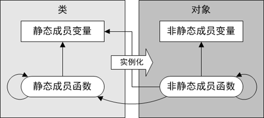
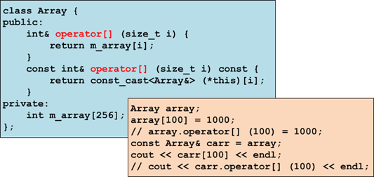

# 1 类的静态成员

## 1.1 静态成员变量

+ 静态成员变量 属于类 而不属于对象

  + 静态成员变量不包含在对象实例中，进程级生命期

  + 静态成员变量的定义和初始化，只能在类的外部而不能在构造函数中进行。

  + 静态成员变量依然受类作用域和访问控制限定符的约束
  + 访问静态成员变量，既可以通过类也可以通过对象
  + 静态成员变量为该类的所有对象实例所共享

```c++
// 01static.cpp
#include <iostream>
using namespace std;
//局部变量:函数内可见,函数域生命期 　静态局部变量:函数内可见,进程级生命期
//全局变量:全局可见  ,进程级生命期 　静态全局变量:本文件可见,进程级生命期
//成员变量:属于对象  ,对象的生命期 　静态成员变量:不属于对象,进程级生命期

class A {
public:
    int m_i; // 声明
    static int m_si; // 声明
};
int A::m_si = 0; // 定义只能在全局域(进程级生命期)
int main( int argc, char* argv[] ) {
    A a, b;
    cout << "a对象大小:" << sizeof(a) << endl;//静态成员不属于对象
    cout << "b对象大小:" << sizeof(b) << endl;

    A::m_si = 100; // 静态成员变量属于类
    cout << "A::m_si=" << A::m_si << endl;

    a.m_si = 800; // A::m_si = 800;
    cout << b.m_si << endl; // A::m_si
    cout << &A::m_si << ' ' << &a.m_si << ' ' << &b.m_si << endl;
    return 0;
}
```

## 1.2 静态成员函数

+ 静态成员函数属于类 而不属于对象

  + 静态成员函数没有this指针，也没有常属性

  + 静态成员依然受类作用域和访问控制限定符的约束

  + 访问静态成员函数，既可以通过类也可以通过对象

  + 静态成员函数只能访问静态成员，而非静态成员函数既可以访问静态成员，也可以访问非静态成员

```c++
// 02static.cpp
#include <iostream>
using namespace std;
class A {
public:
    int m_i; // 声明
    void foo( /* const A* this */ ) const {
        cout << "A::foo()" << endl;
        cout << m_si << endl;
        bar( );
        cout << this->m_i << endl;
        
    }
    static int m_si; // 声明
    static void bar(/*无this参数*/) /*const*/ { // 不属于对象
        cout << "A::bar()" << endl;
//      cout << m_i << endl;     error
//      foo( );                  error
        cout << m_si << endl;
    }
};
int A::m_si = 0; // 定义只能在全局域(进程级生命期)
int main( int argc, char* argv[] ) {
    A a, b;
    a.foo( ); // foo( &a );
    b.foo( ); // foo( &b );
    A::bar( ); // 受类作用域的限定
    a.bar( ); // A::bar( );
    b.bar( ); // A::bar( );
    return 0;
}
```

## 1.3 静态成员



+ 事实上，类的静态成员变量和静态成员函数，更象是普通的全局变量和全局函数，只是多了一层类作用域和访问控制属性的限制，相当于具有成员访问属性的全局变量和全局函数

# 2 单例模式

+ 一个类仅有一个实例
+ 将包括，防止类的拷贝构造函数在内的所有构造函数私有化使用者从类的外部创建对象

+ 公有静态成员函数getInstance()是获取对象实例的唯一渠道

+ 饿汉式：无论用不用，程序启动即创建

+ 懒汉式：用的时候创建，不用了即销毁
  + 引用计数

```c++
// 03hungry.cpp
#include <iostream>
using namespace std;
// 这个类只有定义一个对象
class Singleton {
public:// 4        //5
    static Singleton& getInstance( ) { // 3
        return s_instance;
    }
private:
    Singleton( ) {} // 1
    Singleton( const Singleton& that ) {} //6
    static Singleton s_instance; //唯一的对象(单例) // 2
};
Singleton Singleton::s_instance;
//以上代码模拟类的设计者
//---------------
//以下代码模拟用户
int main( int argc, char* argv[] ) {
//  Singleton s1, s2, s3;
    Singleton& s1 = Singleton::getInstance( );
    Singleton& s2 = Singleton::getInstance( );
    Singleton& s3 = Singleton::getInstance( );
    cout << "&s1:" << &s1 << ", &s2:" << &s2 << ", &s3:" << &s3 << endl;
    return 0;
}
```

```c++
// 04lazy.cpp
#include <iostream>
using namespace std;
// 这个类只有定义一个对象
class Singleton {
public:
    static Singleton& getInstance( ) {
        if( s_instance == NULL )
            s_instance = new Singleton; //　唯一对象
        ++s_counter;
        return *s_instance;
    }
    void releaseInstance( ) {
        if( --s_counter==0 ) {
            delete s_instance;  
            s_instance = NULL;
        }
    }
private:
    Singleton( ) {} 
    Singleton( const Singleton& that ) {} 
    static Singleton* s_instance; // 1
    static int s_counter; // 3
};
Singleton* Singleton::s_instance = NULL; // 2
int Singleton::s_counter = 0; // 引用计数
//以上代码模拟类的设计者
//---------------
//以下代码模拟用户
int main( int argc, char* argv[] ) {
//  Singleton s1, s2, s3;
    Singleton& s1 = Singleton::getInstance( );
    Singleton& s2 = Singleton::getInstance( );
    Singleton& s3 = Singleton::getInstance( );
    cout << "&s1:" << &s1 << ", &s2:" << &s2 << ", &s3:" << &s3 << endl;
    s1.releaseInstance( );
    s2.releaseInstance( );
    s3.releaseInstance( );
    return 0;

}
```

# 3 运算符重载

## 3.1 操作符标记与操作符函数

+ 操作符标记

  + 单目操作符：-、++、--、*、->等

  + 双目操作符：+、-、>、<、+=、-=、>>、<<等

  + 三目操作符：？：

+ 操作符函数 
  + 在特定条件下，编译器有能力把一个由操作数和操作符共同组成的表达式，解释为对一个全局或成员函数的调用，该全局或成员函数被称为操作符函数
  + 通过定义操作符函数，可以实现针对自定义类型的运算法则，并使之与内置类型一样参与各种表达式

```c++
// 05complex.cpp
#include <iostream>
using namespace std;

class Complex {
public:
    Complex( int s, int x ) : m_s(s),m_x(x) {}
    void Print( ) {
        cout << m_s << "+" << m_x << "i" << endl;
    }
    Complex sum( Complex r ) {
        return Complex(m_s+r.m_s, m_x+r.m_x);
    }
    Complex sub( Complex r ) {
        return Complex(m_s-r.m_s, m_x-r.m_x);
    }
private:
    int m_s; // 实部
    int m_x; // 虚部
};

int main( int argc, char* argv[] ) {
    Complex a(1,2), b(3,4), c(5,6), d(7,8);
    Complex res = a.sum(b);// a + b; ===> a.operator+(b) / operator+(a,b)
    res.Print( );

    res = a.sub(b);//a - b; ===> a.operator-(b) / operator-(a,b)
    res.Print( );

    res = a.sum(b).sub(c.sub(d)); // a + b - (c-d);
       // a.operator+(b).operator-(c.operator-(d))
       // operator-(operator+(a,b), operator-(c,d))
    res.Print( );
    return 0;
}
```

+ 双目操作符表达式：L#R

  + 成员函数形式：L.operator# (R)
     左操作数是调用对象，右操作数是参数对象

  + 全局函数形式：::operator# (L, R)
     左操作数是第一参数，右操作数是第二参数

+ 单目操作符表达式：#O/O#
  + 成员函数形式：O.operator# ()
  + 全局函数形式：::operator# (O)

+ 三目操作符表达式：F#S#T
  + 无法重载

## 3.2 典型双目操作符的重载

+ 运算类双目操作符：+、-、*、/等

  + 左右操作数均可为左值或右值

  + 表达式的结果为右值

```c++
// 06doubleoperator1.cpp
#include <iostream>
using namespace std;

class Complex {
public:
    Complex( int s, int x ) : m_s(s),m_x(x) {}
    void Print( ) {
        cout << m_s << "+" << m_x << "i" << endl;
    }
//    Complex operator+(/*const Complex* this*/ const Complex& r ) const {
//        return Complex( m_s+r.m_s, m_x+r.m_x );
//    }
//    Complex operator-(/*const Complex* this*/ const Complex& r ) const {
//        return Complex( m_s-r.m_s, m_x-r.m_x );
//    }
private:
    int m_s; // 实部
    int m_x; // 虚部
    friend Complex operator+( const Complex& l, const Complex& r );
    friend Complex operator-( const Complex& l, const Complex& r );
};
Complex operator+( const Complex& l, const Complex& r ) {
    return Complex( l.m_s + r.m_s, l.m_x + r.m_x );
}
Complex operator-( const Complex& l, const Complex& r ) {
    return Complex( l.m_s - r.m_s, l.m_x - r.m_x );
}
int main( int argc, char* argv[] ) {
    Complex a(1,2), b(3,4);
    const Complex c(5,6), d(7,8);

    Complex res =  a + b; //===> a.operator+(b) / operator+(a,b)
    res.Print( );

    res = a - b; //===> a.operator-(b) / operator-(a,b)
    res.Print( );

    res = c + d;
    res.Print( );

    res = Complex(100,200) + Complex(1000, 2000);
    res.Print( );
    return 0;
}
```

友元：

+ 可以通过friend关键字，把一个全局函数、另一个类的成员函数或者另一个类整体，声明为授权类的友元
+ 友元拥有访问授权类任何非公有成员的特权
+ 友元声明可以出现在授权类的公有、私有或者保护等任何区域，且不受访问控制限定符的约束
+ 友元不是成员，其作用域并不隶属于授权类，也不拥有授权类类型的this指针。


+ 赋值类双目操作符：=、+=、-=、*=、/=等
  + 右操作数为左值或右值，但左操作数必须是非常左值
  + 表达式结果为左操作数本身(而非副本)

```c++
// 07doubleoperator2.cpp
#include <iostream>
using namespace std;

class Complex {
public:
    Complex( int s, int x ) : m_s(s),m_x(x) {}
    void Print( ) {
        cout << m_s << "+" << m_x << "i" << endl;
    }
    Complex& operator+=( const Complex& r) {
        m_s += r.m_s;
        m_x += r.m_x;
        return *this;
    }
private:
    int m_s; // 实部
    int m_x; // 虚部
};
int main( int argc, char* argv[] ) {
    Complex a(1,2), b(3,4);
    const Complex c(5,6), d(7,8);
    a += b; //a.operator+=(b)
    a.Print( );
    b += c; 
    b.Print( );
    a += Complex(1000, 2000);
    a.Print( );
    return 0;
}

```

+ 比较类双目操作符：>、<、==、<=、>=等

  + 左右操作数为左值或右值，

  + 表达式结果为 bool

```c++
// 09doubleoperator3.cpp
#include <iostream>
using namespace std;

class Complex {
public:
    Complex( int s, int x ) : m_s(s),m_x(x) {}
    void Print( ) {
        cout << m_s << "+" << m_x << "i" << endl;
    }
    bool operator==( const Complex& r ) const {
        return m_s==r.m_s && m_x==r.m_x;
    }
    bool operator!=( const Complex& r ) const {
        //return m_s!=r.m_s || m_x!=r.m_x;
        return !(*this==r);
    }
private:
    int m_s; // 实部
    int m_x; // 虚部
};
int main( int argc, char* argv[] ) {
    Complex a(1,2), b(3,4);
    const Complex c(5,6), d(7,8);
    
    cout << (a == b) << endl; // a.operator==(b)
    cout << (a != b) << endl;; // a.operator!=(b)

    cout << (d == c) << endl;
    cout << (d != c) << endl;

    cout << (Complex(100,200) == Complex(1000,2000)) << endl;
    cout << (Complex(100,200) != Complex(1000,2000)) << endl;
    return 0;
}
```

## 3.3 典型单目操作符的重载

+ 运算类单目操作符：-、~、！等
  + 操作数为左值或右值

  + 表达式的值为右值

```c++
// 09singleoperator1.cpp
#include <iostream>
using namespace std;

class Complex {
public:
    Complex( int s, int x ) : m_s(s),m_x(x) {}
    void Print( ) {
        cout << m_s << "+" << m_x << "i" << endl;
    }
    Complex operator-() const {
        return Complex(-m_s, -m_x);
    }
private:
    int m_s; // 实部
    int m_x; // 虚部
};
int main( int argc, char* argv[] ) {
    Complex a(1,2), b(3,4);
    const Complex c(5,6), d(7,8);
    Complex res = -a; // a.operator-()
    res.Print( );
    res = -c;
    res.Print( );
    res = -Complex(1000, 2000);
    res.Print( );
    return 0;
}
```

+ 前自增减类单目操作符：前++、前--

  + 操作数为非常左值

  + 表达式的值为操作数本身(而非副本)

+ 后自增减类单目操作符：后++、后--

  + 操作数为非常左值

  + 表达式的值为右值，且为自增减以前的值

```c++
// 10singleoperator2.cpp
#include <iostream>
using namespace std;

class Complex {
public:
    Complex( int s, int x ) : m_s(s),m_x(x) {}
    void Print( ) {
        cout << m_s << "+" << m_x << "i" << endl;
    }
    Complex& operator++() {
        m_s += 1;
        m_x += 1;
        return *this;
    }
    Complex operator++( int ) {
        Complex old = *this;
        m_s += 1;
        m_x += 1;
        return old;
    }
private:
    int m_s; // 实部
    int m_x; // 虚部
};
int main( int argc, char* argv[] ) {
    Complex a(1,2), b(3,4);
    const Complex c(5,6), d(7,8);
    
    (++a).Print(); // a.operator++()
    a.Print();

    /*| |*/(b++).Print(); // b.operator++(0)
    b.Print( );
    return 0;
}
```

## 3.4 输入和输出操作符的重载

+ 输出操作符：<<                   
  + 左操作数为非常左值形式的输出流(ostream)对象，右操作数为左值或右值
  + 表达式的值为左操作数本身(而非副本)
  + 左操作数的类型为ostream，若以成员函数形式重载该操作符，就应将其定义为ostream类的成员，该类为标准库提供，无法添加新的成员，因此只能以全局函数形式重载该操作符
     ostream& operator<< (ostream& os,
         const RIGHT& right) { … }

+ 输入操作符：>>                         
  + 左操作数为非常左值形式的输入流(istream)对象，右操作数为非常左值
  + 表达式的值为左操作数本身(而非副本)
  + 左操作数的类型为istream，若以成员函数形式重载该操作符，就应将其定义为istream类的成员，该类为标准库提供，无法添加新的成员，因此只能以全局函数形式重载该操作符
     istream& operator>> (istream& is,
         RIGHT& right) { … }

```c++
// 11io.cpp
#include <iostream>
using namespace std;

class Complex {
public:
    Complex( int s=0, int x=0 ) : m_s(s),m_x(x) {}
private:
    int m_s; // 实部
    int m_x; // 虚部
    friend ostream& operator<<( ostream& os, const Complex& v );
    friend istream& operator>>( istream& is, Complex& v );
};
ostream& operator<<( ostream& os, const Complex& v ) {
    os << v.m_s << "+" << v.m_x << "i";
    return os;
}
istream& operator>>( istream& is, Complex& v ) {
    is >> v.m_s >> v.m_x;
    return is;
}
int main( int argc, char* argv[] ) {
    Complex a(1,2), b(3,4);
    const Complex c(5,6), d(7,8);
    cout << a << endl; // cout.operator<<(a) / operator<<(cout,a)
    cout << b << endl;
    cout << Complex(1000,2000) << endl;

    Complex e;
    cin >> e; // cin.operator>>(e)  / operator>>(cin,e)
    cout << e << endl;
    return 0;
}

```

## 3.5 其它操作符的重载

+ 下标操作符：[]             
  + 常用于在容器类型中以下标方式获取数据元素
  + 非常容器的元素为非常左值，常容器的元素为常左值



```c++
// 12index.cpp
#include <iostream>
using namespace std;

class Array { //容器类
public:
    int& operator[](/* Array* this */ size_t i ) {
        return m_arr[i];
    }
    const int& operator[](/*const Array* this*/ size_t i ) const {
        return this->m_arr[i];
    }
private:
    int m_arr[256];
};

int main( int argc, char* argv[] ) {
    Array a; //非常容器
    a[5]=100; // a.operator[](5)
    for( int i=0; i<256; i++ )
        cout << a[i] << ' ';
    cout << endl;

    const Array ca = a; // 常容器
//  ca[5] = 500; // ca.operator[](5) 常容器的元素为常左值（const属性）
    for( int i=0; i<256; i++ )
        cout << ca[i] << ' ';
    cout << endl;
    return 0;
}
```

+ 解引用和间接成员访问操作符：*、->
  + 如果一个类重载了  “解引用”和  “间接成员访问操作符”，那么该类的对象就可以被当做指针来使用.

```c++
// 13autoptr.cpp
#include <iostream>
#include <fcntl.h>
#include <unistd.h>
#include <memory>
using namespace std;

class A {
public:
    A() : m_f(open("./file", O_CREAT|O_RDWR,0644)) {
        //【size_t m_f=open(...);】
        cout << "A() is invoked:file open" << endl;
    }
    ~A() {
        close( m_f );
        cout << "~A() is invoked:file close" << endl;
        //对于基本类型m_f,什么都不做
    } // 释放m_f　本身所占据内存空间
    void foo( ) {
        write( m_f, "hello file", 10 );
        cout << "A::foo() is invoked: file write" << endl;
    }
private:
    size_t m_f;//保存文件描述符
};
class PA {
public:
    PA( A* p ) : m_p(p) {
        //【A* m_p=p;】
    }
    ~PA( ) {
        delete m_p;
    }// 释放m_p本身所占据内存空间
    A& operator*() {
        return *m_p;
    }
    A* operator->() {
        return m_p;
    }
private:
    A* m_p;
};
int main( int argc, char* argv[] ) {
    auto_ptr<A> pa(new A);
    (*pa).foo();
    pa->foo();
//    PA pa=new A;//(new A); //定义pa对象,并利用pa.PA(new A);
//    (*pa).foo( ); //pa.operator*().foo()
//    pa->foo( );   //pa.operator->()->foo()
    return 0;
} // pa.~PA()

```

