# 1 继承

## 1.1 继承的基本概念和语法

+ 共性和个性
+ 抽取共性和保留个性
+ 基类和子类

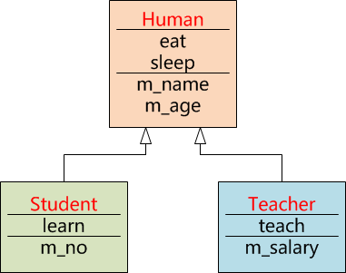

+ 继承与派生

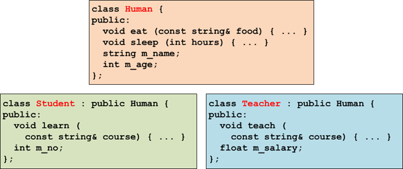

+ 继承的语法
  + class 子类 : 继承方式1 基类1, 继承方式2 基类2, ... {
         …
     };

+ 继承方式
  + 公有继承：public
  + 保护继承：protected
  + 私有继承：private

## 1.2 继承的基本特点

+ 继承所要达到的表象：
  + 子类对象包含基类子对象

+ 子类中可以直接访问基类的所有非私有成员，就“如同”它们在子类中声明一样

+ 继承的本质：
  + 基类的成员在子类中仅仅为可见，而非拥有

+ 注意：
  + 对于继承切忌不要理解为基类的成员变为子类的成员，继承不会改变类成员的作用域，基类的成员永远都是基类的成员，并不会因为继承而变成子类的成员

+ 尽管基类的公有和保护成员在子类中直接可见，但仍然可以在子类中重新定义这些名字，子类中的名字会隐藏所有基类中的同名定义

+ 如果需要在子类中访问一个在基类中定义却被子类标识符所隐藏的名字，可以借助作用域限定操作符“::”实现

```c++
// 01derived.cpp
#include <iostream>
using namespace std;
//子类对象 中 包含 基类部分（基类子对象）
//子类内部 可以访问 基类的 非私有成员
class Base {
public:
    void foo( ) {   cout << "Base::foo()" << endl; }
    int m_a;
protected:
    void bar( ) {   cout << "Base::bar()" << endl; }
    int m_b;
private:
    void hum( ) {   cout << "Base::hum()" << endl; }
    int m_c;
};
class Derived : public /*protected private*/ Base {
public:
    void fun( ) {
        Base::foo( );
        m_a = 100;
        Base::bar( );
        m_b = 200;
//      hum( ); // error
//      m_c = 300; // error
    }
    int m_d;
    void foo( ) {   cout << "Derived::foo()" << endl;   }
    void bar( ) {   cout << "Derived::bar()" << endl;   }
};
int main( int argc, char* argv[] ) {
    Base b; // 12个字节
    cout << "基类对象b的大小:" << sizeof(b) << endl;
    Derived d; // 16个字节:子类对象中一定包含基类子对象
    cout << "子类对象d的大小:" << sizeof(d) << endl;
    d.fun( );
    return 0;
}
```

## 1.3 名字隐藏

+ 因为作用域的不同，分别在子类和基类中定义的同名成员函数(包括静态成员函数)，并不构成重
+ 任何时候，在子类的内部，总可以通过作用域限定操作符“::”，显式地调用那些在基类中定义却被子类所隐藏的成员

## 1.4 继承方式和访问控制

+ 基类中的公有、保护和私有成员，在子类中将对这些基类成员的访问控制限定将重新标记

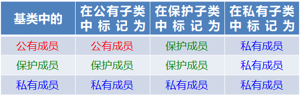

+ 当“通过”子类访问其所继承的基类的成员时，需要考虑因继承方式对访问控制限定的影响

```c++
// 02public.cpp
#include <iostream>
using namespace std;
//子类对象 中 包含 基类部分（基类子对象）
//子类内部 可以访问 基类的 非私有成员
class Base {
public:
    void foo( ) {   cout << "Base::foo()" << endl; }
    int m_a;
protected:
    void bar( ) {   cout << "Base::bar()" << endl; }
    int m_b;
private:
    void hum( ) {   cout << "Base::hum()" << endl; }
    int m_c;
};
class Derived : public Base { 
    //子类重新标定基类成员的访问控制限定
    //foo/m_a是public,bar/m_b是protected,hum/m_c是private
public:
    void fun( ) {
        //子类内部访问基类成员时,编译器查看这些成员在基类中是如何标定的
        foo( );
        m_a = 100;
        bar( );
        m_b = 200;
//      hum( ); // error
//      m_c = 300; // error
    }
    int m_d;
};
int main( int argc, char* argv[] ) {
    //在类的外部,利用子类对象访问基类成员时,编译器将查看这些成员在子类中是如何标定的
    Derived d; 
    d.foo();
    d.m_a=1000;
//  d.bar();
//  d.m_b=2000;
//  d.hum();
//  d.m_c=3000;
    return 0;
}

```

```c++
// 03protected.cpp
#include <iostream>
using namespace std;
class Base {
public:
    void foo( ) {   cout << "Base::foo()" << endl; }
    int m_a;
protected:
    void bar( ) {   cout << "Base::bar()" << endl; }
    int m_b;
private:
    void hum( ) {   cout << "Base::hum()" << endl; }
    int m_c;
};
class Derived : public Base { 
public:
    void fun( ) {
        Base::foo( );
        m_a = 100;
        bar( );
        m_b = 200;
//      hum( ); // error
//      m_c = 300; // error
    }
    int m_d;
    void foo( ) {   cout << "Derived::foo()" << endl;   }
};
int main( int argc, char* argv[] ) {
    Derived d; 
    d.Base::foo();
    d.m_a=1000;
    return 0;
}

```

```c++
// 04private.cpp
#include <iostream>
using namespace std;
//子类对象 中 包含 基类部分（基类子对象）
//子类内部 可以访问 基类的 非私有成员
class Base {
public:
    void foo( ) {   cout << "Base::foo()" << endl; }
    int m_a;
protected:
    void bar( ) {   cout << "Base::bar()" << endl; }
    int m_b;
private:
    void hum( ) {   cout << "Base::hum()" << endl; }
    int m_c;
};
class Derived : private Base { 
    //子类重新标定基类成员的访问控制限定
    //foo/m_a是private,bar/m_b是private,hum/m_c是private
public:
    void fun( ) {
        //子类内部访问基类成员时,编译器查看这些成员在基类中是如何标定的
        foo( );
        m_a = 100;
        bar( );
        m_b = 200;
//      hum( ); // error
//      m_c = 300; // error
    }
    int m_d;
};
int main( int argc, char* argv[] ) {
    //在类的外部,利用子类对象访问基类成员时,编译器将查看这些成员在子类中是如何标定的
    Derived d; 
//  d.foo();
//  d.m_a=1000;
//  d.bar();
//  d.m_b=2000;
//  d.hum();
//  d.m_c=3000;
    return 0;
}
```

+ 子类类型的指针或者引用能隐式转换为基类类型class Human { … };
   class Student : public Human { … };
   Student student ;
   Human* phuman = &student;
   Human& rhuman = student;
  + 编译器认为访问范围缩小是安全的
+ 子类类型的指针或者引用能隐式转换为基类类型

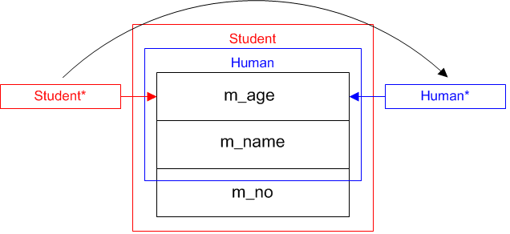

+ 基类类型的指针或者引用不能隐式转换为子类类型

  + class Human { … };
     class Student : public Human { … };
     Human human;
     Student* pstudent =
         static_cast<Student*> (&human);
     Student& rstudent =
         static_cast<Student&> (human);

  + 编译器认为访问范围扩大是危险的

```c++
// 05hs.cpp
#include <iostream>
using namespace std;
//子类对象中包含 基类子对象
class Human {
public:
    int m_age;
    string m_name;
};
class Student : public Human {
public:
    int m_no;
};
int main( int argc, char* argv[] ) {
    Human h; //28 |m_age|m_name|
    cout << "Human类对象h的大小:" << sizeof(h) << endl;
    Student s;//32 |m_age|m_name|m_no|
    cout << "Student类对象s的大小:" << sizeof(s) << endl;
    cout << "整个子类对象首地址:" << &s << endl;
    cout << "&s.m_age:" << &s.m_age << ", &s.m_name:" << &s.m_name
         << ", &s.m_no:" << &s.m_no << endl;

    Human* ph = &s;
    Human& rh = s;

    Student* ps = static_cast<Student*>(&h);
    Student& rs = static_cast<Student&>(h); // 极其不建议，有风险

    ps = static_cast<Student*>(ph); //极其建议，没有风险
    rs = static_cast<Student&>(rh);
    
    return 0;
}

```

+ 编译器对类型安全的检测仅仅基于指针或引用本身
  + class Human { … };
     class Student : public Human { … };
     Student student (…);
     Human* phuman = &student;
     Human& rhuman = student;
     Student* pstudent =
         static_cast<Student*> (phuman);
     Student& rstudent =
         static_cast<Student&> (rhuman);
  + 基类指针或引用的实际目标，究竟是不是子类对象，完全由程序员自己判断

## 1.5 公有继承独有特点

+ 子类对象在类外可以访问基类公有成员（其他继承方式不可以）

+ 如果需要通过子类对象访问一个在基类中定义却被子类标识符所隐藏的名字，可以借助作用域限定操作符“::”实现

```c++
// 06phs.cpp
#include <iostream>
using namespace std;
class Base {
public:
    void foo( ) {   cout << "Base::foo()" << endl; }
    int m_a;
protected:
    void bar( ) {   cout << "Base::bar()" << endl; }
    int m_b;
private:
    void hum( ) {   cout << "Base::hum()" << endl; }
    int m_c;
};
class Derived : public Base { 
public:
    void fun( ) {
        Base::foo( );
        m_a = 100;
        bar( );
        m_b = 200;
//      hum( ); // error
//      m_c = 300; // error
    }
    int m_d;
    void foo( ) {   cout << "Derived::foo()" << endl;   }
};
int main( int argc, char* argv[] ) {
    Derived d; 
    d.Base::foo();
    d.m_a=1000;
    return 0;
}

```

## 1.6 子类的构造与析构

### 1.6.1 构造函数

+ 子类没有定义构造函数
  + 编译器为子类提供的默认无参构造函数，会自动调用其基类的无参构造函数，构造该子类对象中的基类子对象。

+ 子类定义构造函数但没有显示指明基类部分构造方式
  + 编译器会选择其基类的无参构造函数，构造该子类对象中的基类子对象。

+ 子类定义构造函数并显式指明基类部分构造方式
  + 子类的构造函数可以在初始化表中显式指明其基类部分的构造方式，即调用其基类指明的构造函数。

+ 子类对象的构造过程
  + 构造基类子对象->构造成员变量->执行构造代码

+ 阻断继承
  + 子类的构造函数无论如何都会调用基类的构造函数，构造子类对象中的基类子对象

  + 如果把基类的构造函数定义为私有，那么该类的子类就永远无法被实例化为对象

  + 在C++中可以用这种方法阻断一个类被扩展

### 1.6.2 析构函数

+ 子类没有定义析构函数
  + 编译器将提供一个默认析构函数,析构完所有的成员变量以后，会自动调用其基类的析构函数.

+ 子类定义析构函数
  + 子类的析构函数在执行完自身析构代码，并析构完所有的成员变量以后，会自动调用其基类的析构函数.

+ 子类对象的析构过程
  + 执行析构代码->析构成员变量->析构基类子对象

### 1.6.3 子类的拷贝构造

+ 子类没有定义拷贝构造函数
  + 编译器为子类提供的默认拷贝构造函数，会自动调用其基类的拷贝构造函数，构造该子类对象中的基类子对象

+ 子类定义了拷贝构造函数，但没有显式指明其基类部分的构造方式
  + 编译器会选择其基类的无参构造函数，构造该子类对象中的基类子对象

+ 子类定义了拷贝构造函数，同时显式指明了其基类部分以拷贝方式构造
  + 子类对象中的基类部分和扩展部分一起被复制

### 1.6.4 子类的拷贝赋值

+ 子类没有定义拷贝赋值函数
  + 编译器为子类提供的缺省拷贝赋值函数，会自动调用其基类的拷贝赋值函数，复制该子类对象中的基类子对象

+ 子类定义了拷贝赋值函数，但没有显式调用其基类的拷贝赋值函数
  + 子类对象中的基类子对象将得不到复制

+ 子类定义了拷贝赋值函数，同时显式调用了其基类的拷贝赋值函数
  + 子类对象中的和一起被复制

```c++
// 07ccons.cpp
#include <iostream>
using namespace std;

class Human {
public:
    Human( int age=0, const char* name="无名" ) : m_age(age),m_name(name){
        //【int m_age=age;】定义m_age,初值为age
        //【string m_name(name);】定义m_name,并利用m_name.string(name)
        cout << "Human类的缺省构造函数被调用" << endl;
    }
    Human( const Human& that ) : m_age(that.m_age),m_name(that.m_name) {
        //【int m_age=that.m_age;】定义m_age,初值为that.m_age
        //【string m_name(that.m_name);】
        //      定义m_name,并利用m_name.string(that.m_name)
        cout << "Human类拷贝构造函数被调用" << endl;
    }
    Human& operator=( const Human& that ) {
        m_age = that.m_age;
        m_name = that.m_name; // m_name.operator=(that.m_name)
        cout << "Human类的拷贝赋值函数被调用" << endl;
        return *this;
    }
    ~Human( ) {
        cout << "Human类的析构函数被调用" << endl;
        // 本类型m_age,什么都不做
        // 类型m_name,利用m_name.~string()
    } //释放　m_age, m_name 成员变量　本身　所占据内存空间
    void getinfo( ) {
        cout << "姓名:" << m_name << ", 年龄:" << m_age;
    }
private:
    int m_age;      
    string m_name;  
};
class Student : public Human {
public:
//  如果子类没有提供任何构造函数，编译器将提供一个无参构造函数
/*  Student( ) {
        【Human();】定义基类子对象,利用基类子对象.Human()
        【float m_score;】定义m_score,初值为随机数
        【string m_remark;】定义m_remark,并利用m_remark.string()
    }*/
    Student( int age=0, const char* name="无名",
                    float score=0.0, const char* remark="没有")
                       :Human(age,name),m_score(score), m_remark(remark) {
        //【Human(age,name);】定义基类子对象,利用基类子对象.Human(age,name)
        //【float m_score=score;】定义m_score,并赋初值为score
   //【string m_remark(remark);】定义m_remark,并利用m_remark.string(remark)
        cout << "Student类缺省构造函数被调用" << endl;
    }
//  如果子类没有提供析构函数,编译器将提供一个默认的析构函数
/*  ~Student( ) {
        对于基本类型m_score,什么都不做
        对于类类型m_remark,利用m_remark.~string()
        对于基类子对象,利用 基类子对象.~Human()
    } 释放 m_score,m_remark,基类子对象 本身所占据内存空间*/
    ~Student( ) {
        cout << "Student类析构函数被调用" << endl;
        // 对于基本类型m_score,什么都不做
        // 对于类类型m_remark,利用m_remark.~string()
        // 对于基类子对象,利用 基类子对象.~Human()
    } // 释放 m_score,m_remark,基类子对象 本身所占据内存空间
    void getinfo( ) {
        Human::getinfo( );
        cout << ", 成绩:" << m_score << ", 评语:" << m_remark << endl;
    }
private:
    float m_score;
    string m_remark;
};
int main( int argc, char* argv[] ) {
    Student s1(22,"张飞",88.5,"良好");
    s1.getinfo( );
    return 0;
} // s1.~Student()      释放s1对象本身所占据内存空间

```

## 1.7 多重继承

+ 一个类可以同时从多个基类继承实现代码

+ 多重继承的内存布局
  + 子类对象中的多个基类子对象，按照继承表的顺序依次被构造，并从低地址到高地址排列，析构的顺序则与构造严格相反

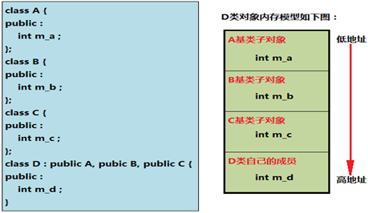

```c++
// 08miorder.cpp
#include <iostream>
using namespace std;
class A {
public:
    int m_a;
    A() {   cout << "A() is invoked" << endl;    }
    ~A(){   cout << "~A() is invoked"<< endl;    }
};
class B {
public:
    int m_b;
    B() {   cout << "B() is invoked" << endl;    }
    ~B(){   cout << "~B() is invoked"<< endl;    }
};
class C {
public:
    int m_c;
    C() {   cout << "C() is invoked" << endl;    }
    ~C(){   cout << "~C() is invoked"<< endl;    }
};
class D : public A, public B, public C { // 汇聚子类
public:
    int m_d;
    D() {   cout << "D() is invoked" << endl;    }
    ~D(){   cout << "~D() is invoked"<< endl;    }    
};
int main( int argc, char* argv[] ) {
    D d; //16  |m_a|m_b|m_c|m_d|
    cout << "汇聚子类对象d的大小:" << sizeof(d) << endl;
    D* pd = &d;
    cout << "汇聚子类对象d的首地址 D*pd=" << pd << endl;
    cout << "A基类子对象的地址:" << &d.m_a << endl;
    cout << "B基类子对象的地址:" << &d.m_b << endl;
    cout << "C基类子对象的地址:" << &d.m_c << endl;
    cout << "D类自己的成员&m_d:" << &d.m_d << endl;
    
    return 0;
}
```

+ 多重继承的类型转换     
  + 将继承自多个基类的子类对象的指针，隐式转换为它的基类类型，编译器会根据各个基类子对象在子类对象中的内存位置，进行适当的偏移计算，以保证指针的类型与其所指向目标对象的类型一致

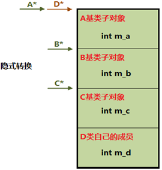

+ 反之，将任何一个基类类型的指针静态转换为子类类型，编译器同样会进行适当的偏移计算

+ 无论在哪个方向上，重解释类型转换(reinterpret_cast)都不进行任何偏移计算

```c++
// 09convcmp.cpp
#include <iostream>
using namespace std;
class A {
public:
    int m_a;
};
class B {
public:
    int m_b;
};
class C {
public:
    int m_c;
};
class D : public A, public B, public C { // 汇聚子类
public:
    int m_d;
};
int main( int argc, char* argv[] ) {
    D d; //16  |m_a|m_b|m_c|m_d|
    cout << "汇聚子类对象d的大小:" << sizeof(d) << endl;
    D* pd = &d;
    cout << "汇聚子类对象d的首地址 D*pd=" << pd << endl;
    cout << "A基类子对象的地址:" << &d.m_a << endl;
    cout << "B基类子对象的地址:" << &d.m_b << endl;
    cout << "C基类子对象的地址:" << &d.m_c << endl;
    cout << "D类自己的成员&m_d:" << &d.m_d << endl;

    cout << "----------隐式转换----------" << endl;
    A* pa = pd;
    cout << "D*pd--->A*pa=" << pa << endl;
    B* pb = pd;
    cout << "D*pd--->B*pb=" << pb << endl;
    C* pc = pd;
    cout << "D*pd--->C*pc=" << pc << endl;
    
    cout << "----------static_cast转换----------" << endl;
    pd = static_cast<D*>(pa);
    cout << "A*pa--->D*pd=" << pd << endl;
    pd = static_cast<D*>(pb);
    cout << "B*pb--->D*pd=" << pd << endl;
    pd = static_cast<D*>(pc);
    cout << "C*pc--->D*pd=" << pd << endl;
    
    cout << "----------reinterpret_cast转换----------" << endl;
    pa = reinterpret_cast<A*>(pd);
    cout << "D*pd--->A*pa=" << pa << endl;
    pb = reinterpret_cast<B*>(pd);
    cout << "D*pd--->B*pb=" << pb << endl;
    pc = reinterpret_cast<C*>(pd);
    cout << "D*pd--->C*pc=" << pc << endl;

    return 0;
}

```

+ 围绕多重继承，历来争议颇多
  + 现实世界中的实体本来就具有同时从多个来源共同继承的特性，因此多重继承有助于面向现实世界的问题域直接建立逻辑模型
  + 多重继承可能会在大型程序中引入令人难以察觉的BUG，并极大地增加对类层次体系进行扩展的难度

+ 名字冲突问题
  + 如果在子类的多个基类中，存在同名的标识符，那么任何试图在子类中，或通过子类对象访问该名字的操作，都将引发歧义。

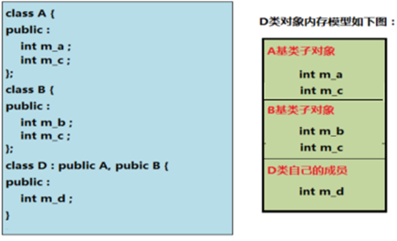

+ 名字冲突问题解决方法
  + 子类隐藏该标识符
  + 通过作用域限定操作符“::”显式指明所属基类

```c++
// 10scope.cpp
#include <iostream>
using namespace std;
class A { //学生类
public:
    int m_a;
    int m_c;//学号
};
class B { //教师类
public:
    int m_b;
    int m_c;//工资
};
class D : public A, public B { // 助教类
public:
    int m_d;
    void foo( ) {
        A::m_c = 2009001;
        B::m_c = 8000000;
    }
//  int m_c; 
};
int main( int argc, char* argv[] ) {
    D d; //20  |m_a m_c|m_b m_c|m_d|
    cout << "汇聚子类对象d的大小:" << sizeof(d) << endl;
    d.A::m_c = 400;
    d.B::m_c = 800;
    return 0;
}
```


## 1.8 钻石继承

–一个子类继承自多个基类，而这些基类又源自共同的祖先，这样的继承结构称为钻石继承(菱形继承)

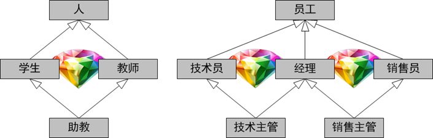

+ 公共基类子对象，在汇聚子类对象中，存在多个实例

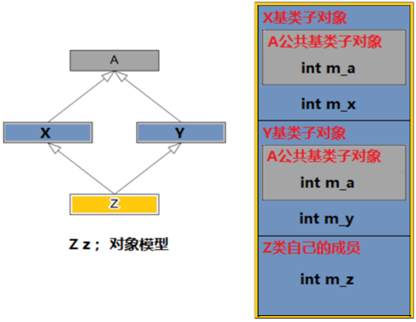

```c++
// 11diamond.cpp
#include <iostream>
using namespace std;
class A { //公共基类   人类
public:
    int m_a; //姓名
};
class X : public A { // 中间子类    学生类
public:
    int m_x;
};
class Y : public A { // 中间子类    教师类
public:
    int m_y;
};
class Z : public X, public Y { // 汇聚子类    助教类
public:
    int m_z;
    void foo( ) {
        m_a = 800;
    }
};

int main( int argc, char* argv[] ) {
    Z z; // 20   |m_a m_x|m_a m_y|m_z|
    cout << "汇聚子类对象z的大小:" << sizeof(z) << endl;
    z.m_a = 400;
    return 0; 
}
```

+ 在汇聚子类中，或通过汇聚子类对象，访问公共基类的成员，会因继承路径的不同而导致匹配歧义

## 1.9 虚继承

+ 钻石继承问题解决方法        virtualinherit.cpp   
  + 在继承表中使用virtual关键字
  + 通过虚继承，可以保证虚公共基类子对象在汇聚子类对象中，仅存一份实例，且为多个中间子类子对象所共享

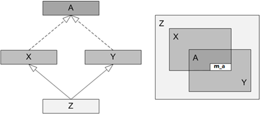

```c++
// 12virtualinherit.cpp
#include <iostream>
using namespace std;
class A { //公共虚基类   人类
public:
    int m_a; //姓名
    A( int a=0) : m_a(a){}
};
class X : virtual public A { // 中间子类    学生类
public:
    X(int x=0) : m_x(x) {}
    int m_x;
};
class Y : virtual public A { // 中间子类    教师类
public:
    int m_y;
    Y(int y=0) : m_y(y) {}
};
class Z : public X, public Y { // 汇聚子类    助教类
public:
    Z(int a, int x, int y, int z) : X(x),Y(y),m_z(z),A(a) {
        //【X(x);】定义X中间子类子对象,并利用X中间子类子对象.X(x)
        //【Y(y);】定义Y中间子类子对象,并利用Y中间子类子对象.Y(y)
        //【int m_z=z;】定义m_z,初值为z
        //【A(a);】定义A公共虚基类子对象,并利用A公共虚基类子对象.A(a)
    }
    int m_z;
    void foo( ) {
        m_a = 800;
    }
};

int main( int argc, char* argv[] ) {
    Z z(10,20,30,40); // 24   |指针 m_x|指针 m_y|m_z|m_a|
    cout << "汇聚子类对象z的大小:" << sizeof(z) << endl;
    cout << z.m_a << ' ' << z.m_x << ' ' << z.m_y << ' ' << z.m_z << endl;
    return 0; 
}
```

+ 虚继承实现原理
  + 汇聚子类对象中的每个中间子类子对象都持有一个指针，通过该指针可以获取 虚基类子对象相对于每个中间子类子对象起始地址的偏移量

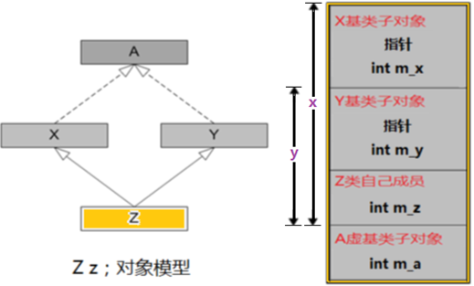

+ 汇聚子类的构造函数负责构造虚公共基类子对象

# 2 多态

