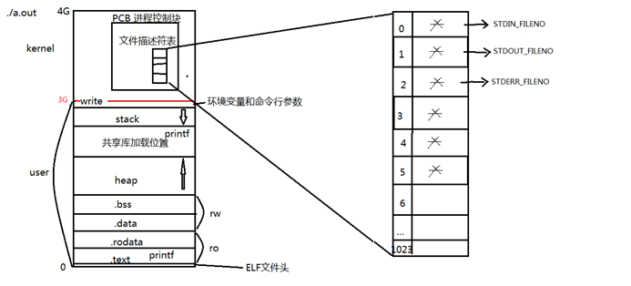

# １、系统调用

由操作系统实现并提供给外部应用程序的编程接口，是应用程序与系统之间的数据交互桥梁。

# 2、 文件IO函数

## 2.1 打开/关闭文件

函数原型：

```c
int open(const char *pathname, int flags);
int open(const char *pathname, int flags, mode_t mode);
int creat(const char *pathname, mode_t mode);
int close(int fd);
```

**常用的参数**：(头文件 <fcntl.h>)

O_RDONLY / O_WRONLY / O_RDWR

O_APPEND / O_CREAT / O_EXCL / O_TRUNC / O_NONBLOCK

**PCB进程控制块：**



**文件描述符**：

结构体PCB 的成员变量file_struct *file 指向文件描述符表。

从应用程序使用角度，该指针可理解记忆成一个字符指针数组，下标0/1/2/3/4...找到文件结构体。

本质是一个键值对0、1、2...都分别对应具体地址。但键值对使用的特性是自动映射，我们只操作键不直接使用值。

新打开文件返回文件描述符表中未使用的最小文件描述符。

STDIN_FILENO  	0
STDOUT_FILENO  1
STDERR_FILENO	2

查看内核源码方法：搜索lxr --> lxr.oss.org.cn

最大打开文件数：

```log
[root@localhost chapter02]# ulimit -a
core file size          (blocks, -c) 0
data seg size           (kbytes, -d) unlimited
scheduling priority             (-e) 0
file size               (blocks, -f) unlimited
pending signals                 (-i) 3756
max locked memory       (kbytes, -l) 64
max memory size         (kbytes, -m) unlimited
open files                      (-n) 1024
pipe size            (512 bytes, -p) 8
POSIX message queues     (bytes, -q) 819200
real-time priority              (-r) 0
stack size              (kbytes, -s) 8192
cpu time               (seconds, -t) unlimited
max user processes              (-u) 3756
virtual memory          (kbytes, -v) unlimited
file locks                      (-x) unlimited
```

## 2.2 读写函数

```c
ssize_t read(int fd, void *buf, size_t count); 
ssize_t write(int fd, const void *buf, size_t count); 
```

举个栗子：实现简单的cp功能

```c
// 01cp.c
#include <sys/types.h>
#include <sys/stat.h>
#include <fcntl.h>
#include <stdlib.h>
#include <stdio.h>
#include <unistd.h>
#include <errno.h>

int main(int argc, char* argv[]) {
    int fd1,fd2;
    char buf[1024];
    int len;

    if(argc != 3) {
        fprintf(stderr, "Usage: %s <srcfile> <dstfile>\n", argv[0]); 
        exit(EXIT_FAILURE);
    }

    if((fd1 = open(argv[1], O_RDONLY)) < 0) {
        perror("open()"); 
        exit(EXIT_FAILURE);
    }

    if((fd2 = open(argv[2], O_CREAT | O_WRONLY, 0666)) < 0) {
        perror("open()"); 
        exit(EXIT_FAILURE);
    }

    while((len = read(fd1, buf, sizeof(buf))) != 0)
        write(fd2, buf, len);
    
    close(fd1);
    close(fd2);
}
```

Note: 在shell中可以使用strace命令跟踪程序的执行，查看调用的系统函数。

## 2.3 阻塞与非阻塞

先明确一下阻塞（Block）这个概念。当进程调用一个阻塞的系统函数时，该进程被置于**睡眠**（Sleep）状态，这时内核调度其它进程运行，直到该进程等待的事件发生了（比如网络上接收到数据包，或者调用sleep指定的睡眠时间到了）它才有可能继续运行。与睡眠状态相对的是运行（Running）状态，在Linux内核中，处于运行状态的进程分为**两种情况**：

正在被调度执行。CPU处于该进程的上下文环境中，程序计数器（eip）里保存着该进程的指令地址，通用寄存器里保存着该进程运算过程的中间结果，正在执行该进程的指令，正在读写该进程的地址空间。

就绪状态。该进程不需要等待什么事件发生，随时都可以执行，但CPU暂时还在执行另一个进程，所以该进程在一个就绪队列中等待被内核调度。系统中可能同时有多个就绪的进程，那么该调度谁执行呢？内核的调度算法是基于优先级和时间片的，而且会根据每个进程的运行情况动态调整它的优先级和时间片，让每个进程都能比较公平地得到机会执行，同时要兼顾用户体验，不能让和用户交互的进程响应太慢。

举个栗子：阻塞读终端

```c
// 02block_read.c
#include <stdio.h>
#include <stdlib.h>
#include <unistd.h>
#include <errno.h>
#include <sys/types.h>
#include <sys/stat.h>
#include <fcntl.h>

int main(int argc, char* argv[]) {
    char buf[10];
    int fd, len;

    len = read(STDIN_FILENO, buf, 10);
    if(len < 0) {
        perror("read()"); 
        exit(EXIT_FAILURE);
    }

    write(STDOUT_FILENO, buf, len);
    return 0;
}
```

非阻塞读终端

```c
// 03nonblock_read.c
#include <stdio.h>
#include <stdlib.h>
#include <sys/stat.h>
#include <sys/types.h>
#include <fcntl.h>
#include <unistd.h>
#include <errno.h>
#include <string.h>

int main(int argc, char* argv[]) {
    int fd, len;
    char buf[10];

    fd = open("/dev/tty", O_RDONLY | O_NONBLOCK);
    if(fd < 0) {
        perror("open()"); 
        exit(EXIT_FAILURE);
    }

tryagain:
    len = read(fd, buf, 10);
    if(len < 0) {
        if(errno != EAGAIN) {
            perror("read()"); 
            exit(EXIT_FAILURE);
        }
        sleep(3);
        write(STDOUT_FILENO, "Try again", strlen("Try again"));
        goto tryagain;
    }

    write(STDOUT_FILENO, buf, len);

    return 0;
}
```

## 2.4 lseek函数

使用lseek来修改文件偏移量

```c
off_t lseek(int fd, off_t offset, int whence); 失败返回-1；成功：返回的值是较文件起始位置向后的偏移量。
// 特别的：lseek允许超过文件结尾设置偏移量，文件会因此被拓展。
```

举个栗子：使用lseek扩展文件

```c
// 04lseek.c
#include <stdio.h>
#include <stdlib.h>
#include <unistd.h>
#include <errno.h>
#include <sys/stat.h>
#include <sys/types.h>
#include <fcntl.h>

#define SIZE 100

int main(int argc, char* argv[]) {
    int fd;

    if((fd = open("test.txt", O_WRONLY | O_CREAT, 0666)) < 0) {
        perror("open"); 
        exit(EXIT_FAILURE);
    }

    lseek(fd, SIZE, SEEK_END);
    write(fd, "Test", 5);

    close(fd);
    return 0;
}
/*
od -tcx filename  查看文件的16进制表示形式
od -tcd filename  查看文件的10进制表示形式 
*/
```

## 2.5 fcntl函数

```c
#include <fcntl.h>

int fcntl(int fd, int cmd, ...);
// 返回值：正确返回值根据命令码而定，错误返回-1。
```

fcntl是用来**修改已经打开文件的属性的函数**，包含5个功能

### 2.5.1 复制一个文件描述符

功能和dup()和dup2() 类似，对应的cmd：F_DUPFD、F_DUPFD_CLOEXEC

```c
复制一个已有文件描述符，功能和dup和dup2相同，对应的cmd：F_DUPFD、F_DUPFD_CLOEXEC。
当使用这两个cmd时，需要传入第三个参数，fcntl返回复制后的文件描述符，此返回值是之前未被占用的描述符，并且必须一个大于等于第三个参数值。F_DUPFD命令要求返回的文件描述符会清除对应的FD_CLOEXEC标志；F_DUPFD_CLOEXEC要求设置新描述符的FD_CLOEXEC标志。

获取、设置文件描述符标志，对应的cmd：F_GETFD、F_SETFD。
用于设置FD_CLOEXEC标志，此标志的含义是：当进程执行exec系统调用后此文件描述符会被自动关闭。

获取、设置文件访问状态标志，对应的cmd：F_GETFL、F_SETFL。
获取当前打开文件的访问标志，设置对应的访问标志，一般常用来设置做非阻塞读写操作。

获取、设置记录锁功能，对应的cmd：F_GETLK、F_SETLK、F_SETLKW。

获取、设置异步I/O所有权，对应的cmd：F_GETOWN、F_SETOWN。
获取和设置用来接收SIGIO/SIGURG信号的进程id或者进程组id。返回对应的进程id或者进程组id取负值。
```

## 2.6 ioctl 函数

设备驱动程序中常用，见驱动编程。
