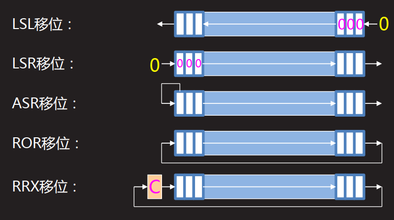

[TOC]

# 1 ARM指令集

## 1.1 数据处理指令

数据处理指令可以细分为4类：

+ 数据传送指令（MOV/MVN）
+ 算术运算指令（ADD/ADC/SUB/SBC/RSB/RSC）
+ 位运算指令（AND/ORR/EOR/BIC）
+ 比较指令（CMP/CMN/TST/TEQ）

数据处理指令的一般格式：

```assembly
<opcode>{cond}{S} <Rd>, <Rn>, <shifter_operand>
```

例：

```assembly
ADD R0,R1,#1
MOVEQ R0,R2
SUBEQS R0,R1,R2,LSR#1
CMP R1,R3
```

数据处理指令的地址模式

第1操作数恒为寄存器Rn

shifter_operand即第2操作数，是一个移位操作数，共有11种形式

```assembly
;格式 								说明
#<immediate> 						; 立即数方式
<Rm> 								; 寄存器
<Rm>, LSL #<shift_imm> 				; Rm逻辑左移shift_imm位
<Rm>, LSL <Rs> 						; Rm逻辑左移Rs位
<Rm>, LSR #<shift_imm> 				; Rm逻辑右移shift_imm位
<Rm>, LSR <Rs> 						; Rm逻辑右移Rs位
<Rm>, ASR #<shift_imm> 				; Rm算术右移shift_imm位
<Rm>, ASR <Rs> 						; Rm算术右移Rs位
<Rm>, ROR #<shift_imm> 				; Rm循环右移shift_imm位
<Rm>, ROR <Rs> 						; Rm循环右移Rs位
<Rm>, RRX 							; Rm扩展的循环右移一位
```

数据处理指令的移位操作



### 1.1.1 数据传送指令

#### 1.1.1.1 MOV指令

MOV 指令是最简单的 ARM 指令，执行的结果就是把一个数 N 送到目标寄存器 Rd，其中 N 可以是寄存器，也可以是立即数。

MOV 指令多用于设置初始值或者在寄存器间传送数据。

MOVS 指令将移位码（shifter_operand）表示的数据传送到目的寄存器 Rd，并根据操作的结果更新 CPSR 中相应的条件标志位。

1. 指令的语法格式

```assembly
MOV{<cond>}{S} <Rd>,<shifter_operand>
```

2. 例子

```assembly
MOV R0, R0 ; R0 = R0… NOP 指令
MOV R0, R0, LSL#3  ; R0 = R0 * 8
```

如果 R15 是目的寄存器，将修改程序计数器或标志。这用于被调用的子函数结束后返回到调用代码，方法是把连接寄存器的内容传送到 R15

```assembly
MOV PC, R14 ; 退出到调用者，用于普通函数返回，PC 即是 R15
MOVS PC, R14 ; 退出到调用者并恢复标志位，用于异常函数返回
```

3. 小结

MOV指令主要完成以下功能

+ 将数据从一个寄存器传送到另一个寄存器。

+ 将一个常数值传送到寄存器中。

+ 实现无算术和逻辑运算的单纯移位操作，操作数乘以 2^n 可以用左移 n 位来实现。

+ 当 PC（R15）用作目的寄存器时，可以实现程序跳转。如“MOV PC，LR”，所以这种跳转可以实现子程序调用及从子程序返回，代替指令“B，BL”。

+ 当 PC 作为目标寄存器且指令中 S 位被设置时，指令在执行跳转操作的同时，将当前处理器模式的 SPSR 寄存器的内容复制到 CPSR 中。这种指令“MOVS PC LR”可以实现从某些异常中断中返回。

#### 1.1.1.2 MVN指令

MVN 是反相传送（Move Negative）指令。它将操作数的**反码**传送到目的寄存器。

MVN 指令多用于向寄存器**传送一个负数或生成位掩码**。

MVN 指令将 shifter_operand 表示的数据的反码传送到目的寄存器 Rd，并根据操作结果更新 CPSR 中相应的条件标志位。

1. 指令的语法格式

```assembly
MNV{<cond>}{S} <Rd>,<shifter_operand>
```

2. 例子

MVN 指令和 MOV 指令相同，也可以把一个数 N 送到目标寄存器 Rd，其中 N 可以是立即数，也可以是寄存器。这是逻辑非操作而不是算术操作，这个取反的值加 1 才是它的取负的值。

```assembly
MVN R0, #4 ; 
MVN R0, #0 ; R0 = -1
```

3. 小结

- 向寄存器中传送一个负数
- 生成位掩码
- 求一个数的反码

### 1.1.2 算术运算指令

#### 1.1.2.1 ADD指令（加法）

ADD 指令将寄存器 shifter_operand 的值加上 Rn 表示的数值，并将结果保存到目标寄存器 Rd 中

```assembly
ADD{<cond>}{S} <Rd>,<Rn>,<shifter_operand>
```

2. 例子

```assembly
ADD R0, R1, R2  ; R0 = R1 + R2
ADD R0, R1, #256 ; R0 = R1 + 256
ADD R0, R2, R3,LSL#1 ; R0 = R2 + (R3 << 1)
```

#### 1.1.2.2 ADC指令（带进位的加法）

ADC 指令将寄存器 shifter_operand 的值加上 Rn 表示的数值，再加上 CPSR 中的 C 条件标志位的值，将结果保存到目标寄存器 Rd 中

1. 指令的语法格式

```assembly
ADC{<cond>}{S} <Rd>,<Rn>,<shifter_operand>
```

2. 例子

ADC 指令将把两个操作数加起来，并把结果放置到目的寄存器中。它使用一个进位标志位，这样就可以做比 32 位大的加法。下面的例子将加两个 128 位的数。
128 位结果：寄存器 R0、R1、R2 和 R3。

第一个 128 位数：寄存器 R4、R5、R6 和 R7。

第二个 128 位数：寄存器 R8、R9、R10 和 R11。

```assembly
ADDS R0, R4, R8 ;加低端的字
ADCS R1, R5, R9 ;加下一个字，带进位
ADCS R2, R6, R10 ;加第三个字，带进位
ADCS R3, R7, R11 ;加高端的字，带进位
```

#### 1.1.2.3 SUB指令（减法）

SUB（Subtract）指令从寄存器 Rn 中减去 shifter_operand 表示的数值，并将结果保存到目标寄存器 Rd 中

1. 指令的语法格式

```assembly
SUB{<cond>}{S} <Rd>,<Rn>,<shifter_operand>
```

2. 例子

```assembly
@ R0 = R1 − R2。
SUB R0, R1, R2
```

```assembly
@ R0 = R1 − 256。
SUB R0, R1, #256
```

#### 1.1.2.4 RSB指令（反向减法）

RSB（Reverse Subtract）指令从寄存器 shifter_operand 中减去 Rn 表示的数值，并将结果保存到目标寄存器 Rd 中

1. 指令的语法格式

```assembly
RSB{<cond>}{S} <Rd>,<Rn>,<shifter_operand>
```

2. 例子

```assembly
@ 下面的指令序列可以求一个 64 位数值的负数。64 位数放在寄存器 R0 与 R1 中，其负
@ 数放在 R2 和 R3 中。其中 R0 与 R2 中放低 32 位值。
RSBS R2,R0,#0
RSC R3,R1,#0
```

#### 1.1.2.5 RSC指令（带借位反向减法）

RSC（Reverse Subtract with Carry）指令从寄存器 shifter_operand 中减去 Rn 表示的数值，再减去寄存器 CPSR 中 C 条件标志位的反码［NOT（Carry Flag）］，并将结果保存到目标寄存器 Rd 中

1. 指令的语法格式

```assembly
RSC{<cond>}{S} <Rd>,<Rn>,<shifter_operand>
```

2. 例子

```assembly
@ 下面的程序使用 RSC 指令实现求 64 位数值的负数。
RSBS R2,R0,#0
RSC R3,R1,#0
```

#### 1.1.2.6 SBC指令（带借位减法）

SBC（Subtract with Carry）指令用于执行操作数大于 32 位时的减法操作。该指令从寄存器 Rn 中减去 shifter_operand 表示的数值，再减去寄存器 CPSR 中 C 条件标志位的反码[NOT（Carry flag）]，并将结果保存到目标寄存器 Rd 中

1. 指令的语法格式

```assembly
SBC{<cond>}{S} <Rd>,<Rn>,<shifter_operand>
```

2. 例子

```assembly
@ 下面的程序使用 SBC 实现 64 位减法，（R1，R0）−（R3，R2），结果存放到（R1，R0）。
SUBS R0,R0,R2
SBCS R1,R1,R3
```

### 1.1.3 位运算指令

#### 1.1.3.1 AND指令（与）

AND 指令将 shifter_operand 表示的数值与寄存器 Rn 的值按位（bitwise）做逻辑与操作，并将结果保存到目标寄存器 Rd 中

1. 指令的语法格式

```assembly
AND{<cond>}{S} <Rd>,<Rn>,<shifter_operand>
```

2. 例子

```assembly
@ 保留 R0 中的 0 位和 1 位，丢弃其余的位。
AND R0, R0, #3
```

```assembly
@ R2 = R1&R3
AND R2, R1, R3
```

```assembly
@ R0 = R0&0x01，取出最低位数据。
ANDS R0,R0,#0x01
```

#### 1.1.3.2 ORR指令（或）

ORR（Logical OR）为逻辑或操作指令，它将第 2 个源操作数 shifter_operand 的值与寄存器 Rn 的值按位做“逻辑或”操作，结果保存到 Rd 中

1. 指令的语法格式

```assembly
ORR{<cond>}{S} <Rd>,<Rn>,<shifter_operand>
```

2. 例子

```assembly
@ 设置 R0 中位 0 和 1。
ORR R0, R0, #3
```

```assembly
@ 将 R0 的低 4 位置 1。
ORR R0,R0,#0x0F
```

#### 1.1.3.3 EOR指令（异或）

**EOR**（Exclusive OR）指令将寄存器 Rn 中的值和 shifter_operand 的值执行按位“异或”操作，并将执行结果存储到目的寄存器 Rd 中

1. 指令语法格式

```assembly
EOR{<cond>}{S} <Rd>,<Rn>,<shifter_operand>
```

2. 例子

```assembly
@ 反转 R0 中的位 0 和 1。
EOR R0, R0, #3
```

```assembly
@ 将 R1 的低 4 位取反
EOR R1,R1,#0x0F
```

```assembly
@ R2 = R1∧R0
EOR R2,R1,R0
```

#### 1.1.3.4 BIC指令（位清零）

BIC（Bit Clear）位清零指令，将寄存器 Rn 的值与第 2 个源操作数 shifter_operand 的值的反码按位做“逻辑与”操作，结果保存到 Rd 中。

1. 指令的语法格式

```assembly
BIC{<cond>}{S} <Rd>,<Rn>,<shifter_operand>
```

2. 例子

```assembly
@ 清除 R0 中的位 0、1 和 3，保持其余的不变。
BIC R0, R0, #0b1011
```

```assembly
@ 将 R3 的反码和 R2 做“逻辑与”操作，结果保存到 R1 中。
BIC R1,R2,R3
```

### 1.1.4 比较测试指令

#### 1.1.4.1 CMP指令（比较）

CMP（Compare）指令使用寄存器 Rn 的值减去 operand2 的值，根据操作的结果更新CPSR 中相应的条件标志位，以便后面的指令根据相应的条件标志来判断是否执行。

CMP 指令允许把一个寄存器的内容与另一个寄存器的内容或立即值进行比较，更改状态标志来允许进行条件执行。它进行一次减法，但不存储结果，而是正确地更改标志位。标志位表示的是操作数 1 与操作数 2 比较的结果（其值可能为大于、小于、相等）。如果操作数 1 大于操作数 2，则此后的有 GT 后缀的指令将可以执行。显然，CMP 不需要显式地指定 S 后缀来更改状态标志。

1. 指令语法格式

```assembly
CMP{<cond>} <Rn>,<shifter_operand>
```

2. 例子

```assembly
@ 比较 R1 和立即数 10 并设置相关的标志位。
CMP R1,#10
```

```assembly
@ 比较寄存器 R1 和 R2 中的值并设置相关的标志位。
CMP R1,R2
12
```

通过上面的例子可以看出，CMP 指令与 SUBS 指令的区别在于 CMP 指令不保存运算结果，在进行两个数据大小判断时，常用 CMP 指令及相应的条件码来进行操作。

#### 1.1.4.2 CMN指令（负数比较）

CMN（Compare Negative）指令使用寄存器 Rn 的值减去 operand2 的负数值（加上operand2），根据操作的结果更新 CPSR 中相应的条件标志位，以便后面的指令根据相应的条件标志来判断是否执行。

1. 指令的语法格式

```assembly
CMN{<cond>} <Rn>,<shifter_operand>
```

**6.2 应用示例一**

CMN 指令将寄存器 Rn 中的值加上 shifter_operand 表示的数值，根据加法的结果设置CPSR 中相应的条件标志位。寄存器 Rn 中的值加上 shifter_operand 的操作结果对 CPSR 中条件标志位的影响，与寄存器 Rn 中的值减去 shifter_operand 的操作结果的相反数对 CPSR中条件标志位的影响有细微差别。当第 2 个操作数为 0 或者为 0x80000000 时，两者结果不同。比如下面两条指令。

```assembly
@ 第 1 条指令使标志位 C 值为 1，第 2 条指令使标志位 C 值为 0。
CMP Rn,#0
CMN Rn,#0
```

```assembly
@ 下面的指令使 R0 值加 1，判断 R0 是否为 1 的补码，若是，则 Z 置位。
CMN R0,#1
```

#### 1.1.4.3 TST指令（位测试）

TST（Test）测试指令用于将一个寄存器的值和一个算术值进行比较。条件标志位根据两个操作数做“逻辑与”后的结果设置。

1. 指令的语法格式

```assembly
TST{<cond>} <Rn>,<shifter_operand>
```

2. 例子

TST 指令类似于 CMP 指令，不产生放置到目的寄存器中的结果。而是在给出的两个操作数上进行操作并把结果反映到状态标志上。使用 TST 指令来检查是否设置了特定的位。操作数 1 是要测试的数据字，而操作数 2 是一个位掩码。经过测试后，如果匹配则设置 Zero标志，否则清除它。与 CMP 指令一样，该指令不需要指定 S 后缀。下面的指令测试在 R0 中是否设置了位 0。

```assembly
TST R0, #1
```

#### 1.1.4.4 TEQ（相等测试）

TEQ（Test Equivalence）指令用于将一个寄存器的值和一个算术值做比较。条件标志位根据两个操作数做“逻辑异或”后的结果设置。以便后面的指令根据相应的条件标志来判断是否执行。

1. 指令的语法格式

```assembly
TEQ{<cond>} <Rn>,<shifter_operand>
```

2. 例子

```assembly
@ 下面的指令是比较 R0 和 R1 是否相等，该指令不影响 CPSR 中的 V 位和 C 位。
TEQ R0,R1
```

TST 指令与 EORS 指令的区别在于 TST 指令不保存运算结果。使用 TEQ 进行相等测试，常与 EQ 和 NE 条件码配合使用，当两个数据相等时，条件码 EQ 有效；否则条件码NE 有效。

练习：求最大公约数

> 如果有一个自然数A能被自然数B整除，则称A为B的倍数， B为A的约数。
> 几个自然数公有的约数，叫做这几个自然数的公约数。
> 公约数中最大的一个公约数，称为这几个自然数的最大公约数。
> 这里我们采用循环减法来计算两个自然数的最大公约数。假定我们计算X和Y的最大公约数是L，那么X=m×L， Y=n×L，计算X和Y的最大公约数可以采取：
> 1、如果X和Y不相等，则计算X和Y的差值Z
> 2、用Z取代X和Y中的大者
> 3、比较X和Y，如果相等则找到了最大公约数L
> 4、如果X和Y不相等则重复1、 2、 3，直到找到L。 

