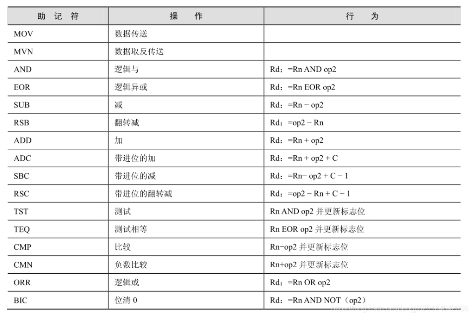

# 1 ARM处理器的指令集

## 1.1 数据指令集

数据操作指令是指对存放在寄存器中的数据进行操作的指令。主要包括**数据传送指令、算术指令、逻**
**辑指令、比较与测试指令及乘法指令**。
如果在数据处理指令前使用S前缀，指令的执行结果将会影响 CPSR 中的标志位。数据处理指令如表
所示：



### 1.1.1 MOV 指令

MOV 指令是最简单的 ARM 指令，执行的结果就是把一个数 N 送到目标寄存器 Rd，其中 N 可以是寄存器，也可以是立即数。

MOV 指令多用于设置初始值或者在寄存器间传送数据。

MOVS 指令将移位码（shifter_operand）表示的数据传送到目的寄存器 Rd，并根据操作的结果更新 CPSR 中相应的条件标志位。

1. 指令的语法格式

```assembly
MOV{<cond>}{S} <Rd>,<shifter_operand>
```

2. 例子

```assembly
MOV R0, R0 ; R0 = R0… NOP 指令
MOV R0, R0, LSL#3  ; R0 = R0 * 8
```

如果 R15 是目的寄存器，将修改程序计数器或标志。这用于被调用的子函数结束后返回到调用代码，方法是把连接寄存器的内容传送到 R15

```assembly
MOV PC, R14 ; 退出到调用者，用于普通函数返回，PC 即是 R15
MOVS PC, R14 ; 退出到调用者并恢复标志位，用于异常函数返回
```

3. 小结

MOV指令主要完成以下功能

① 将数据从一个寄存器传送到另一个寄存器。

② 将一个常数值传送到寄存器中。

③ 实现无算术和逻辑运算的单纯移位操作，操作数乘以 2^n 可以用左移 n 位来实现。

④ 当 PC（R15）用作目的寄存器时，可以实现程序跳转。如“MOV PC，LR”，所以这种跳转可以实现子程序调用及从子程序返回，代替指令“B，BL”。

⑤ 当 PC 作为目标寄存器且指令中 S 位被设置时，指令在执行跳转操作的同时，将当前处理器模式的 SPSR 寄存器的内容复制到 CPSR 中。这种指令“MOVS PC LR”可以实现从某些异常中断中返回。

### 1.1.2 MVN指令

MVN 是反相传送（Move Negative）指令。它将操作数的**反码**传送到目的寄存器。

MVN 指令多用于向寄存器**传送一个负数或生成位掩码**。

MVN 指令将 shifter_operand 表示的数据的反码传送到目的寄存器 Rd，并根据操作结果更新 CPSR 中相应的条件标志位。

1. 指令的语法格式

```assembly
MNV{<cond>}{S} <Rd>,<shifter_operand>
```

2. 例子

MVN 指令和 MOV 指令相同，也可以把一个数 N 送到目标寄存器 Rd，其中 N 可以是立即数，也可以是寄存器。这是逻辑非操作而不是算术操作，这个取反的值加 1 才是它的取负的值。

```assembly
MVN R0, #4 ; 
MVN R0, #0 ; R0 = -1
```

3. 小结

+ 向寄存器中传送一个负数
+ 生成位掩码
+ 求一个数的反码

### 1.1.3 AND指令

AND 指令将 shifter_operand 表示的数值与寄存器 Rn 的值按位（bitwise）做逻辑与操作，并将结果保存到目标寄存器 Rd 中

1. 指令的语法格式

```assembly
AND{<cond>}{S} <Rd>,<Rn>,<shifter_operand>
```

2. 例子

```assembly
@ 保留 R0 中的 0 位和 1 位，丢弃其余的位。
AND R0, R0, #3
```

```assembly
@ R2 = R1&R3
AND R2, R1, R3
```

```assembly
@ R0 = R0&0x01，取出最低位数据。
ANDS R0,R0,#0x01
```

### 1.1.4 EOR指令

**EOR**（Exclusive OR）指令将寄存器 Rn 中的值和 shifter_operand 的值执行按位“异或”操作，并将执行结果存储到目的寄存器 Rd 中，同时根据指令的执行结果更新 CPSR 中相应的条件标志位。

1. 指令语法格式

```assembly
EOR{<cond>}{S} <Rd>,<Rn>,<shifter_operand>
```

2. 例子

```assembly
@ 反转 R0 中的位 0 和 1。
EOR R0, R0, #3
```

```assembly
@ 将 R1 的低 4 位取反
EOR R1,R1,#0x0F
```

```assembly
@ R2 = R1∧R0
EOR R2,R1,R0
```

### 1.1.5 SUB指令（减法）

SUB（Subtract）指令从寄存器 Rn 中减去 shifter_operand 表示的数值，并将结果保存到目标寄存器 Rd 中

1. 指令的语法格式

```assembly
SUB{<cond>}{S} <Rd>,<Rn>,<shifter_operand>
```

2. 例子

```assembly
@ R0 = R1 − R2。
SUB R0, R1, R2
```

```assembly
@ R0 = R1 − 256。
SUB R0, R1, #256
```

### 1.1.6 RSB指令（反向减法）

RSB（Reverse Subtract）指令从寄存器 shifter_operand 中减去 Rn 表示的数值，并将结果保存到目标寄存器 Rd 中

1. 指令的语法格式

```assembly
RSB{<cond>}{S} <Rd>,<Rn>,<shifter_operand>
```

2. 例子

```assembly
@ 下面的指令序列可以求一个 64 位数值的负数。64 位数放在寄存器 R0 与 R1 中，其负
@ 数放在 R2 和 R3 中。其中 R0 与 R2 中放低 32 位值。
RSBS R2,R0,#0
RSC R3,R1,#0
```

### 1.1.7 RSC指令（带借位反向减法）

RSC（Reverse Subtract with Carry）指令从寄存器 shifter_operand 中减去 Rn 表示的数值，再减去寄存器 CPSR 中 C 条件标志位的反码［NOT（Carry Flag）］，并将结果保存到目标寄存器 Rd 中

1. 指令的语法格式

```assembly
RSC{<cond>}{S} <Rd>,<Rn>,<shifter_operand>
```

2. 例子

```assembly
@ 下面的程序使用 RSC 指令实现求 64 位数值的负数。
RSBS R2,R0,#0
RSC R3,R1,#0
```

### 1.1.8 SBC指令（带借位减法）

SBC（Subtract with Carry）指令用于执行操作数大于 32 位时的减法操作。该指令从寄存器 Rn 中减去 shifter_operand 表示的数值，再减去寄存器 CPSR 中 C 条件标志位的反码[NOT（Carry flag）]，并将结果保存到目标寄存器 Rd 中

1. 指令的语法格式

```assembly
SBC{<cond>}{S} <Rd>,<Rn>,<shifter_operand>
```

2. 例子

```assembly
@ 下面的程序使用 SBC 实现 64 位减法，（R1，R0）−（R3，R2），结果存放到（R1，R0）。
SUBS R0,R0,R2
SBCS R1,R1,R3
```

### 1.1.9 ADD指令

ADD 指令将寄存器 shifter_operand 的值加上 Rn 表示的数值，并将结果保存到目标寄存器 Rd 中，并根据指令的执行结果设置 CPSR 中相应的标志位。

1. 指令的语法格式

```assembly
ADD{<cond>}{S} <Rd>,<Rn>,<shifter_operand>
```

2. 例子

```assembly
ADD R0, R1, R2  ; R0 = R1 + R2
ADD R0, R1, #256 ; R0 = R1 + 256
ADD R0, R2, R3,LSL#1 ; R0 = R2 + (R3 << 1)
```

### 1.1.10 ADC指令

ADC 指令将寄存器 shifter_operand 的值加上 Rn 表示的数值，再加上 CPSR 中的 C 条件标志位的值，将结果保存到目标寄存器 Rd 中，并根据指令的执行结果设置 CPSR 中相应的标志位。

1. 指令的语法格式

```assembly
ADC{<cond>}{S} <Rd>,<Rn>,<shifter_operand>
```

2. 例子

ADC 指令将把两个操作数加起来，并把结果放置到目的寄存器中。它使用一个进位标志位，这样就可以做比 32 位大的加法。下面的例子将加两个 128 位的数。
128 位结果：寄存器 R0、R1、R2 和 R3。

第一个 128 位数：寄存器 R4、R5、R6 和 R7。

第二个 128 位数：寄存器 R8、R9、R10 和 R11。

```assembly
ADDS R0, R4, R8 ;加低端的字
ADCS R1, R5, R9 ;加下一个字，带进位
ADCS R2, R6, R10 ;加第三个字，带进位
ADCS R3, R7, R11 ;加高端的字，带进位
```

### 1.1.11 TST测试指令


### 1.1.12 TEQ指令


### 1.1.13 CMP指令


### 1.1.14 CMN指令


### 1.1.15 ORR指令


### 1.1.16 BIC位清零指令


